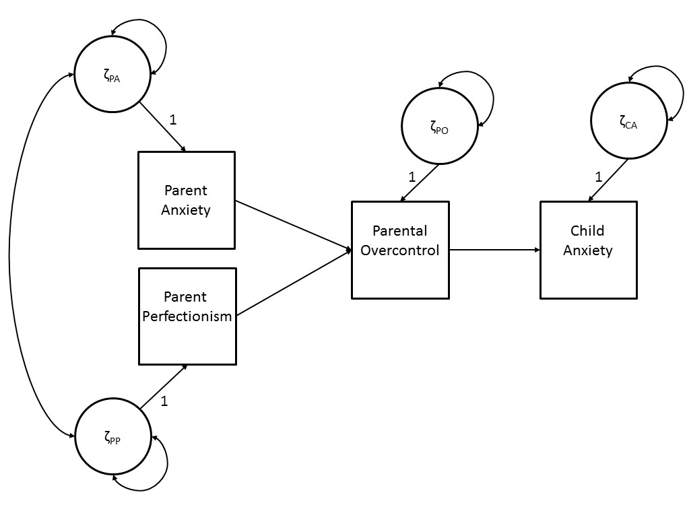

# Path Models {#ch3}

Path analysis is one of the families of statistical analyses within the structural equation modeling (SEM) framework. Path analysis is used to describe the dependencies between a set of observed variables, where a structural model defines the directional relations between the variables. Path analysis builds on regression analysis principles, but can be used for more complex models that include multiple dependent variables or (multiple) mediator variables. We will first introduce the illustrative example that is used throughout this and subsequent chapters on path models. Then, we will explain the path model both conceptually and technically. Finally, we will illustrate how to fit a path model with an empirical data example using the `lavaan` program.

## Illustrative example

To illustrate path analysis we will use data from a study by Affrunti and Woodruff-Borden (2014) who investigated the development of child anxiety. They hypothesized that perfectionistic parents will engage in behaviors characterized by overcontrol, which then will increase child anxiety. In addition, parent anxiety was thought to influence child anxiety. In order to test their hypothesized model the variables parent perfectionism, parental overcontrol, parent anxiety and child anxiety were measured in 77 families (see Affrunti & Woodruff-Borden, 2014 for more information on data collection and operationalization of the variables). In this chapter we will use a slightly adapted version of the model on the development of child anxiety.

## Conceptual explanation

Figure \@ref(fig:fig3-1) is a graphical display of the path diagram of the structural model for the development of child anxiety that serves our illustrative purposes. A path diagram is a graphical representation of the path model in which the directional relationships between observed variables are defined. The four squares represent the observed variables parental anxiety (PA), parental perfectionism (PP), parental overcontrol (PO) and child anxiety (CA). The effects between the observed variables are represented by one sided arrows (→).

In our example, the model consists of direct effects from parent anxiety and parent perfectionism on parental overcontrol, and a direct effect of parental overcontrol on child anxiety. Parent anxiety and parent perfectionism are so-called "exogenous" variables. The states or values of exogenous variables are not influenced by other variables in the model. They are sometimes also referred to as independent variables or predictor variables. Parental overcontrol and child anxiety are so-called "endogenous" variables, as they are assumed to be influenced by the states of the other variables in the model. An endogenous variable is sometimes referred to as a dependent variable. However, an endogenous variable can also have an effect on another endogenous variable in the model. In our example, parental overcontrol is influenced by parent anxiety and parent perfectionism (i.e., parental overcontrol is an endogenous variable). Parental overcontrol, in turn, also has a direct effect on child anxiety. This path model therefore represents a mediation model, where the effects of parent anxiety and parent perfectionism on child anxiety are fully mediated through parental overcontrol.

```{r label="fig3-1", echo = FALSE, out.width = "80%", fig.align = "center", fig.cap="A simple path diagram of the development of child anxiety." }



```

Figure \@ref(fig:fig3-1) not only gives a graphical representation of the set of directional relations between the observed variables, but also includes the circles ${\zeta}_{PA}$, ${\zeta}_{PP}$, ${\zeta}_{PO}$, and ${\zeta}_{CA}$ that represent the so-called residual factors. Residual factors are unobserved, latent variables that represent all factors that fall outside the model but may influence the states of the corresponding observed variables. The directional effects from the residual factors to the corresponding observed variables are accompanied by the numeral '1'. This indicates that these effects are fixed to '1', which is a so-called scaling constant (which will be explained in more detail in [Chapter 12](#ch12)). Because these scaling constants for residual factors apply to almost all models, they are often not displayed in path diagrams.

For endogenous variables, the residual factor can be viewed as a kind of 'container' variable, that contains all variables that also affect the specific endogenous variable, but that were not included in the model. The residual factors therefore symbolize the probabilistic causality of path analysis, as they indicate that endogenous variables are not only influenced by other variables in the model but also by (unobserved) variables that are outside the model (i.e., unmeasured causes). For example, in the model for the development of child anxiety, it would be unrealistic to assume that the anxiety of a child is only determined by parents' behavior of overcontrol. It might be that there are also other factors, e.g. past experiences, contact with peers, or genetic predisposition, that have an effect on the anxiety of a child. To enable a model where child anxiety is only partially influenced by parental overcontrol, the unmeasured causes of child anxiety are incorporated in the model through the residual factor. The residual factors of endogenous variables are therefore sometimes also referred to as disturbance factors.

The residual factors of exogenous variables can also be viewed as a container variable that contains all (unobserved) variables that are outside the model (i.e., unmeasured causes) that influence the corresponding exogenous variable. However, because exogenous variables are not influenced by other variables in the model, the residual factor of an exogenous variable represents the corresponding variable. In addition, the residual factors of different exogenous variables covary. For example, in the path diagram of Figure \@ref(fig:fig3-1) there is a covariance between the two residual factors of parent anxiety and parent perfectionism, as reflected by the double headed arrow (\<--\>). This reflects the assumption that the unmeasured causes of the corresponding exogenous variables may covary, although the model does not provide an explanation for this association (i.e., they are outside the model). For example, parental neuroticism may be a common cause of parental anxiety and parental perfectionism, leading to a covariance between the two variables. Because the common causes are not modelled, and we may not even know all possible sources of shared variance between exogenous variables, it is very unrealistic to assume that the exogenous variables would not be correlated.

For both exogenous and endogenous variables, the residual factor also reflects measurement error. The variance of a residual factor therefore partly consists of variance of the corresponding variable due to random error fluctuations. Thus, one cannot distinguish residual variance due to measurement error (i.e., unsystematic variance) and residual variance due to unmeasured causes (i.e., systematic variance). When the measure of the observed variable is unreliable this will inflate the variance of the corresponding residual factor and can be confounded with variance due to unmeasured causes of the variable.

## Matrix explanation

In general, the aim of path analysis is to describe the dependencies between a set of observed variables, based on some theory. In order to do this, we try to define a theoretically sensible path model that can accurately describe the variances and covariances of the observed variables in the population and formulate the following hypothesis:

$\mathbf{\Sigma}_{\text{population}} = \mathbf{\Sigma}_{\text{model}}$,

where $\mathbf{\Sigma}_{\text{population}}$ is the matrix of population variances and covariances of the observed variables, and $\mathbf{\Sigma}_{\text{model}}$ is the matrix of variances and covariances of the observed variables as implied by the path model. The population variances and covariances are unknown, as data are usually only collected in a sample that was drawn from the population. Therefore, we estimate the population variances and covariances based on the sample variances and covariances:

$\mathbf{\Sigma}_{\text{population}} \approx \mathbf{\hat\Sigma}_{\text{population}}$ , where $\mathbf{\hat\Sigma}_{\text{population}} = \mathbf{\Sigma}_{\text{sample}}$.

As a covariance matrix is a symmetric matrix, usually the upper triangle of the matrix is not provided:

$$
\mathbf{\Sigma}_{\text{population}} = 
\begin{bmatrix} 
\sigma_{11}  & & \\ 
\sigma_{21} & \sigma_{22} & \\
\sigma_{31} & \sigma_{32} & \sigma_{33} \\
\sigma_{41} & \sigma_{42} & \sigma_{43} & \sigma_{44}
\end{bmatrix}
\approx 
\begin{bmatrix} 
\hat\sigma_{11}  & & \\ 
\hat\sigma_{21} & \hat\sigma_{22} & \\
\hat\sigma_{31} & \hat\sigma_{32} & \hat\sigma_{33} \\
\hat\sigma_{41} & \hat\sigma_{42} & \hat\sigma_{43} & \hat\sigma_{44}
\end{bmatrix}.
$$

The variances of the variables are given on the diagonal of the matrix ($\sigma_{11}$ to $\sigma_{44}$) and the covariances are given on the lower triangle of the matrix (e.g., $\sigma_{21}$ represents the covariance between variable $\mathrm{y}_2$ and variable $\mathrm{y}_1$). The values of the upper triangular are equal to the lower triangular (e.g., $\sigma_{21}$ is equal to $\sigma_{12}$). The population variances and covariances are estimated using the sample variances and covariances, where:

$$
\mathbf{\Sigma}_{\text{sample}} = 
\begin{bmatrix} 
s_{11}  & & \\ 
s_{21} & s_{22} & \\
s_{31} & s_{32} & s_{33} \\
s_{41} & s_{42} & s_{43} & s_{44}
\end{bmatrix}.
$$

Here, the elements of $\mathbf{\Sigma}_{\text{sample}}$ are denoted with 's'. As an example, the observed sample variance of the first variable, $s_{11}$, serves as an estimate of the population variance of the first variable, $\hat\sigma_{11}$. The sample covariance matrix of our illustrative example of child anxiety is given by:

$$
\mathbf{\Sigma}_{\text{sample}} =
\begin{bmatrix}
91.58  & & \\ 
53.36 & 194.32 & \\
28.39 & 50.90 & 130.19 \\
9.21 & 4.98 & 9.41 & 7.56
\end{bmatrix}.
$$

Thus, the variance of the variable parent anxiety is 91.58, and the covariance between the variables parent anxiety and parent perfectionism is 53.36.

Similarly, we do not know the 'true' variances and covariances of the observed variables in the population as implied by the 'true' model parameters in the path model. Instead, we derive an estimated variance-covariance matrix as implied by the model:

$\mathbf{\Sigma}_{\text{model}} \approx \mathbf{\hat\Sigma}_{\text{model}}$,

where $\mathbf{\hat\Sigma}_{\text{model}}$ is a function of sample estimates of the unknown model parameters. Thus, to enable calculation of $\mathbf{\hat\Sigma}_{\text{model}}$ we first need to derive estimates of all model parameters that feature in the path model. Below, we will describe the relationships between the observed variables in terms of model parameters, and explain how they can be used to find expressions for the variances and covariances.

Figure \@ref(fig:fig3-2) shows the Greek symbols that represent the variables and parameters that feature in the path model. The observed variables parental anxiety, parental perfectionism, parental overcontrol and child anxiety are represented by the squares $\mathrm{y}_1$, $\mathrm{y}_2$, $\mathrm{y}_3$, and $\mathrm{y}_4$ respectively. The direct effects between the observed variables are denoted $\beta_{31}$, $\beta_{32}$, and $\beta_{43}$. These direct effects are also called path coefficients and can be interpreted as regression coefficients. In general, $\beta_{ij}$ is the regression of variable $\mathrm{y}_{i}$ on $\mathrm{y}_{j}$, or, equivalently, the effect of $\mathrm{y}_{j}$ on $\mathrm{y}_{i}$. In addition, the circles are residual factors $\zeta_{1}$, $\zeta_{2}$, $\zeta_{3}$, and $\zeta_{4}$ that represent all factors that fall outside the model, i.e., unmeasured causes.

```{r label="fig3-2", echo = FALSE, out.width = "80%", fig.align = "center", fig.cap="Path diagram of the development of child anxiety including all path coefficients." }

knitr::include_graphics("images/Fig2.Week2.Ch3.jpg")

```

Using the symbols described above, the relations between the variables can be represented by the following equations:

\begin{equation}
\mathrm{y}_1 = \zeta_1
(\#eq:3-01)
\end{equation}

\begin{equation}
\mathrm{y}_2 = \zeta_2
(\#eq:3-02)
\end{equation}

\begin{equation}
\mathrm{y}_3=\beta_{31}\mathrm{y}_1+\beta_{32}\mathrm{y}_2 + \zeta_3
(\#eq:3-03)
\end{equation}

\begin{equation}
\mathrm{y}_4 = \beta_{43} \mathrm{y}_3 + \zeta_4
(\#eq:3-04)
\end{equation}

Here, we can see that exogenous variables $\mathrm{y}_1$ and $\mathrm{y}_2$ are only affected by factors that fall outside the model ($\zeta_1$ and $\zeta_2$), whereas endogenous variable $\mathrm{y}_3$ and $\mathrm{y}_4$ are affected also by the other variables in the model. Note that the effects of the residual factors are left out of these Equations because they are constrained to '1' (i.e., we could write $\mathrm{y}_1 = (\text{direct effect})\zeta_1$, where (direct effect) = 1, which thus simplifies to $\mathrm{y}_1$ = $\zeta_1$).

Instead of writing down the equation for each observed variable, the equations for the observed variables $\mathrm{y}_1$, $\mathrm{y}_2$, $\mathrm{y}_3$, and $\mathrm{y}_4$ can also be written in matrix form:

\begin{equation}
\mathbf{y} = \mathbf{B} \mathbf{y} + \boldsymbol{\zeta}
(\#eq:3-05)
\end{equation}

where $\mathbf{y}$ is a vector of all observed variables, $\boldsymbol{\zeta}$ is a vector of all residual factors, and $\mathbf{B}$ is a matrix of regression coefficients:

$$
\mathbf{y} =
\begin{bmatrix}
\mathrm{y}_1 \\ 
\mathrm{y}_2 \\
\mathrm{y}_3 \\
\mathrm{y}_4
\end{bmatrix}
, \boldsymbol{\zeta} = 
\begin{bmatrix}
\zeta_1 \\ 
\zeta_2 \\
\zeta_3 \\
\zeta_4
\end{bmatrix}, \mathrm{and} \hspace{1mm} \mathbf{B} = 
\begin{bmatrix}
0 & 0 & 0 & 0 \\
0 & 0 & 0 & 0 \\ 
\beta_{31} &  \beta_{32} & 0 & 0 \\ 
0 & 0 & \beta_{43} & 0
\end{bmatrix}.
$$

Matrix $\mathbf{B}$ contains three non-zero elements: $\beta_{31}$, $\beta_{32}$, $\beta_{43}$. The regression coefficient $\beta_{31}$ represent the effect ofvariable $\mathrm{y}_1$ on variable $\mathrm{y}_3$, the regression coefficient $\beta_{32}$ represent the effect of variable $\mathrm{y}_2$ on variable $\mathrm{y}_3$, and the regression coefficient $\beta_{43}$ represent the effect of variable $\mathrm{y}_3$ on variable $\mathrm{y}_4$.

Substituting these matrices into Equation \@ref(eq:3-05) gives:

\begin{equation}
\begin{bmatrix}
\mathrm{y}_1 \\ 
\mathrm{y}_2 \\
\mathrm{y}_3 \\
\mathrm{y}_4
\end{bmatrix}
=  
\begin{bmatrix}
0 & 0 & 0 & 0 \\
0 & 0 & 0 & 0 \\ 
\beta_{31} &  \beta_{32} & 0 & 0 \\ 
0 & 0 & \beta_{43} & 0
\end{bmatrix}
\times
\begin{bmatrix}
\mathrm{y}_1 \\ 
\mathrm{y}_2 \\
\mathrm{y}_3 \\
\mathrm{y}_4
\end{bmatrix}
+
\begin{bmatrix}
\zeta_1 \\ 
\zeta_2 \\
\zeta_3 \\
\zeta_4
\end{bmatrix}, 
(\#eq:3-06)
\end{equation} 

which yields:

\begin{equation}
\begin{bmatrix}
\mathrm{y}_1 \\ 
\mathrm{y}_2 \\
\mathrm{y}_3 \\
\mathrm{y}_4
\end{bmatrix}
=  
\begin{bmatrix}
& &  \zeta_1  & & \\
& & \zeta_2  & & \\ 
\beta_{31} \mathrm{y}_1 & + & \beta_{32} \mathrm{y}_2 & + & \zeta_3 \\
& & \beta_{43} \mathrm{y}_3 + \zeta_4 & 
\end{bmatrix}. 
(\#eq:3-07)
\end{equation}

Here, we can see that the equations for variables $\mathrm{y}_1$, $\mathrm{y}_2$, $\mathrm{y}_3$, and $\mathrm{y}_4$ are the same as separate Equations \@ref(eq:3-01) through \@ref(eq:3-04).

The path model as described by Equation \@ref(eq:3-07) is used to describe the relationships between the observed variables. In order to find the model for the variances and covariances of the observed variables, we have to re-write Equation \@ref(eq:3-05) as a function of model parameters:

$$\mathrm{y} = \mathbf{B} \mathrm{y} + \zeta \Leftrightarrow$$
\begin{equation}
\mathrm{y} = (\mathbf{I} - \mathbf{B})^{-1} \zeta
(\#eq:3-08)
\end{equation}

where $\mathbf{I}$ is an identity matrix that needs to be introduced to come to the end result, and $(\mathbf{I} - \mathbf{B})^{-1}$ denotes the inverse of the matrix $(\mathbf{I} - \mathbf{B})$. Derivations of Equation \@ref(eq:3-08) are given in this chapters [Appendix](#derivations-of-equation-3.08).

We now have an expression for the scores on the variables. However, in standard SEM, we do not model the observed scores directly, but the variances and covariance of the observed scores. Therefore, we need to find an expression for the model implied covariance matrix. Using \@ref(eq:3-08) and some covariance algebra, we obtain the expression for the variances and covariances of $\mathrm{y}$, called $\mathbf{\Sigma}_{\text{model}}$ = COV$(\mathbf{y},\mathbf{y})$:

\begin{equation}
\mathbf{\Sigma}_{\text{model}} = (\mathbf{I} - \mathbf{B})^{-1} \boldsymbol{\Psi} (\mathbf{I} - \mathbf{B})^{-1\mathrm{T}}
(\#eq:3-09)
\end{equation}

where $\boldsymbol{\Psi}$ is written for COV($\boldsymbol\zeta$,$\boldsymbol\zeta$), and $(\mathbf{I} - \mathbf{B})^{-1\mathrm{T}}$ denotes the transpose of the matrix $(\mathbf{I} - \mathbf{B})^{-1}$. Derivations of Equation \@ref(eq:3-09) are given this chapters [Appendix ](#derivations-of-equation-3.09).

The symmetric matrix $\boldsymbol{\Psi}$ contains the variances and the covariances of the residual factors $\boldsymbol\zeta$. For the model given in Equation \@ref(eq:3-07), matrix $\boldsymbol{\Psi}$ is

$$
\boldsymbol{\Psi} = 
\begin{bmatrix}
\psi_{11} & \psi_{12} & 0 & 0 \\
\psi_{21} & \psi_{22} & 0 & 0 \\
0 & 0 & \psi_{33} & 0 \\
0 & 0 & 0 & \psi_{44}
\end{bmatrix}
$$

where $\psi_{11}$ and $\psi_{22}$ represent the variances of $\zeta_1$ and $\zeta_2$ and are thus equivalent with the variances of the exogenous variables $\mathrm{y}_1$ and $\mathrm{y}_2$. The covariance of $\zeta_{1}$ and $\zeta_{2}$ is represented by $\psi_{12}$ and is thus equivalent with the covariance of $\mathrm{y}_1$ and $\mathrm{y}_2$. Because a covariance matrix is a symmetric matrix, $\psi_{12}$ is equal to $\psi_{21}$. Parameters $\psi_{33}$ and $\psi_{44}$ are the variances of $\zeta_3$ and $\zeta_4$, equivalent with the residual variances (or disturbance variances) of $\mathrm{y}_3$ and $\mathrm{y}_4$, that is, that part of the variances of $\mathrm{y}_3$ and $\mathrm{y}_4$ that are not explained by the model.Note that the $\zeta$ variances associated with endogenous variables $\mathrm{y}_3$ and $\mathrm{y}_4$ have the same interpretation as the $\zeta$ variances associated with exogenous variables $\mathrm{y}_1$ and $\mathrm{y}_2$, but whereas all variance of $\mathrm{y}_1$ and $\mathrm{y}_2$ is unexplained by the model (and thus $\psi_{11}$ and $\psi_{22}$ are equivalent with the variances of $\mathrm{y}_1$ and $\mathrm{y}_2$), only part of the variances of $\mathrm{y}_3$ and $\mathrm{y}_4$ is unexplained by the model.

Now that we have found the general expression for the variances and covariances as a function of model parameters, we can evaluate Equation \@ref(eq:3-09) of our example. Substituting $\mathbf{B}$ and $\boldsymbol{\Psi}$ of our example we obtain:

$\mathbf{\Sigma}_{\text{model}} = (\mathbf{I} - \mathbf{B})^{-1} \boldsymbol{\Psi} (\mathbf{I} - \mathbf{B})^{-1\mathrm{T}}$, where:

$$
(\mathbf{I} - \mathbf{B})^{-1} = 
\Bigg(
\begin{bmatrix}
1 & 0 & 0 & 0 \\
0 & 1 & 0 & 0 \\
0 & 0 & 1 & 0 \\
0 & 0 & 0 & 1 \\
\end{bmatrix} 
- 
\begin{bmatrix}
0 & 0 & 0 & 0  \\
0 & 0 & 0 & 0 \\ 
\beta_{31} & \beta_{32} & 0 & 0 \\ 
0 & 0 & \beta_{43} & 0 
\end{bmatrix} 
\Bigg)
^{-1} 
= 
\begin{bmatrix}
1 & 0 & 0 & 0 \\
0 & 1 & 0 & 0 \\
\beta_{31} & \beta_{32} & 1 & 0 \\
\beta_{31}\beta_{43} & \beta_{32}\beta_{43} & \beta_{43} & 1 
\end{bmatrix}, 
$$
$$
\boldsymbol{\Psi} = 
\begin{bmatrix}
\psi_{11} & \psi_{21} & 0 & 0 \\
\psi_{21} & \psi_{22} & 0 & 0 \\
0 & 0 & \psi_{33} & 0 \\
0 & 0 & 0 & \psi_{44} 
\end{bmatrix}, \mathrm{and}
$$

$$
(\mathbf{I} - \mathbf{B})^{-1\mathrm{T}} = 
\Bigg(
\begin{bmatrix}
1 & 0 & 0 & 0 \\
0 & 1 & 0 & 0 \\
0 & 0 & 1 & 1 \\
0 & 0 & 0 & 1
\end{bmatrix}
-
\begin{bmatrix}
0 & 0 & 0 & 0 \\
0 & 0 & 0 & 0 \\
\beta_{31} & \beta_{32} & 0 & 0 \\
0 & 0 & \beta_{43} & 0 
\end{bmatrix}
\Bigg)^{-1\mathrm{T}}
=
\begin{bmatrix}
1 & 0 & \beta_{31} & \beta_{31}\beta_{43} \\ 
0 & 1 & \beta_{32} & \beta_{32}\beta_{43} \\ 
0 & 0 & 1 & \beta_{43} \\ 
0 & 0 & 0 & 1
\end{bmatrix}. 
$$


Which yields:

```{=tex}
\begin{equation}
\Sigma_{\text{model}} = 
\begin{bmatrix} 
\\
\psi_{11} & & & \\

\\
\psi_{21} & \psi_{22} & & \\ 

\\
\beta_{31} \psi_{11} +  & \beta_{31} \psi_{21} +  & (\beta_{31}\psi_{11}+\beta_{32}\psi_{31}) \beta_{31} +  & \\
\beta_{32} \psi_{21}&\beta_{32} \psi_{22}&(\beta_{31}\psi_{21}+\beta_{32}\psi_{22}) \beta_{32}\psi_{33}&
\\
\\

\beta_{31}\beta_{43}\psi_{11} +  & \beta_{31}\beta_{43}\psi_{21} +  & (\beta_{31}\beta_{43}\psi_{11} + \beta_{32}\beta_{43}\psi_{21}) \beta_{31} + & (\beta_{31}\beta_{43}\psi_{11} + \beta_{32}\beta_{43}\psi_{21})\beta_{31}\beta_{43} +  \\

\beta_{32}\beta_{43}\psi_{21} & \beta_{32}\beta_{43}\psi_{22} & (\beta_{31}\beta_{43}\psi_{21} + \beta_{32}\beta_{43}\psi_{22}) \beta_{32} + & (\beta_{31}\beta_{43}\psi_{21} + \beta_{32}\beta_{43} \psi_{22})\beta_{32}\beta_{43} + \\
&&\beta_{43}\psi_{33} & {\beta_{32}}^2 \psi_{33} + \psi_{44} \\
&&&\\
\end{bmatrix}
(\#eq:3-10)
\end{equation}
```

Now that we have found the expression of $\mathbf{\Sigma}_{\text{model}}$ as a function of model parameters, this enables the estimation of the model parameters, by choosing the values for each model parameter in such a way, that the resulting model implied variances and covariances of $\mathbf{\hat\Sigma}_{\text{model}}$ are as close as possible to the sample variances and covariances, $\mathbf{\hat\Sigma}_{\text{population}}$. A discrepancy function can be used to obtain parameter estimates, where an iterative procedure yields model parameters that keep the discrepancy between $\mathbf{\hat\Sigma}_{\text{population}}$ and $\mathbf{\hat\Sigma}_{\text{model}}$ to a minimum. In general, smaller values of discrepancy functions indicate better fit of the model to the data, and a value of zero indicates the fit is perfect, i.e., if the parameter estimates can perfectly reproduce the sample covariance matrix. Several discrepancy functions exist, but maximum likelihood estimation is most commonly applied. The resulting discrepancy value can be used for the assessment of overall goodness-of-fit using the so-called chi-square test of exact fit, where a significant chi-square value indicates a significant deviation between model and data (i.e., implying that $\mathbf{\hat\Sigma}_{\text{population}} \ne \mathbf{\Sigma}_{\text{model}}$). See also Chapters [10](#ch10) and [11](#ch11), where the topics of [Estimation](#ch10) and [Evaluation of Model Fit](#ch11) are explained in more detail.

In our illustrative example of child anxiety, maximum likelihood estimation leads to the following model parameter estimates: 

$$
\hat{\mathbf{B}}
= 
\begin{bmatrix}
0 & 0 & 0 & 0 \\
0 & 0 & 0 & 0 \\
\hat\beta_{31} & \hat\beta_{32} & 0 & 0 \\
0 & 0 & \hat\beta_{43} & 0 
\end{bmatrix}
=
\begin{bmatrix}
0 & 0 & 0 & 0 \\
0 & 0 & 0 & 0 \\
0.19 & 0.21 & 0 & 0 \\
0 & 0 & 0.07 & 0 
\end{bmatrix}, 
$$

and

$$
\hat{\boldsymbol{\Psi}} = 
\begin{bmatrix}
\hat\psi_{11} & \hat\psi_{21} & 0 & 0 \\
\hat\psi_{21} & \hat\psi_{22} & 0 & 0 \\
0 & 0 & \hat\psi_{33} & 0 \\
0 & 0 & 0 & \hat\psi_{44}
\end{bmatrix}
= 
\begin{bmatrix}
92.58 & 53.36 & 0 & 0 \\
53.36 & 194.32 & 0 & 0 \\
0 & 0 & 114.16 & 0 \\
0 & 0 & 0 & 6.88
\end{bmatrix}. 
$$

Matrix $\hat{\mathbf{B}}$ contains the estimated regression coefficients $\hat\beta_{31}$, $\hat\beta_{32}$ and $\hat\beta_{43}$. The estimated regression of parental overcontrol on parent anxiety ($\hat\beta_{31}$) is 0.19. As the parameter estimate is unstandardized, this indicates that with 1 point increase in parent anxiety there will be 0.19 point increase in parental overcontrol, holding parental perfectionism constant. The estimated effect of parent perfectionism on parental overcontrol ($\hat\beta_{32}$) is 0.21, indicating that controlled for parental anxiety, 1 point increase in parent perfectionism will lead to 0.21 point increase in parental overcontrol. Lastly, the estimated effect of parental overcontrol on child anxiety is 0.07, where 1 point increase in parental overcontrol will result in a 0.07 increase in child anxiety. All estimated effects between the variables are positive, and they support the hypothesis that parent anxiety and perfectionism increase parental overcontrol, which then increases child anxiety. However, the unstandardized parameter estimates do not give a direct interpretation of the size of the effects, and additional information is needed to judge the significance of the effects (see also Chapters [5](#ch5) and [6](#ch6)).

Matrix $\hat{\boldsymbol{\Psi}}$ contains the estimated variances and covariance of the residual factors. Here, we can see that the variance of the residual factor of parent anxiety ($\psi_{11}$) is 91.58 and the variance of the residual factor of parent perfectionism ($\psi_{22}$) is 194.32. Remember that the variances of exogenous variables are not explained by any observed variables, and thus all variance in parent anxiety and parent perfectionism is represented by the variances of their corresponding residual factors. In addition, the covariance between parent anxiety and parent perfectionism is equal to the covariance between their corresponding residual factors ($\psi_{21}$). The variance of the residual factor of overcontrol ($\psi_{33}$) can be interpreted as the variance of overcontrol that is unexplained by the model. The same is true for the estimated variance of the residual factor of child anxiety ($\psi_{44}$).

As the estimated model parameters of the psi-matrix provide information about the amount of variance that is unexplained by the model, we can also calculate the amount of variance that is explained by the model. The variance explained by the model is a result that is often reported in ordinary regression analysis as an indication of how well the model fits the data. Therefore, just as in regression analysis, it is informative to calculate the proportion of explained variance by using the estimated residual factor variance (i.e., the unexplained variance). In our example, the unexplained variance of the observed variable child anxiety is 6.88. We can calculate the proportion of explained variance of child anxiety using the following formula:

$R^2 = 1 - \frac{\text{unexplained, residual variance}}{\text{total variance}}$.

In our example the proportion of explained variance of child anxiety is 0.09, indicating that only 9$\%$ of the variance of child anxiety is explained by the path model that was specified (see also [Chapter 5](#ch5) on standardized parameters).

## Path analysis using lavaan

### Installing lavaan

The software that we will use to run our structural equation modeling analyses is lavaan (Rosseel, 2012), which is free open-source software that is available as a package in R. To install the `lavaan` package you can type the following command in the R console:

```{r eval=FALSE}
install.packages("lavaan", dependencies = TRUE)
```

This will open a window where you have to select a CRAN mirror (select `"[your country], [closest city]"`) and will install the package `lavaan`, including all the packages that it is dependent upon. You only need to install the package once (on a specific computer), to add the package to the R library. Once the package is installed, you can activate all the functionalities that are available in the package by using the command:

```{r eval=FALSE}
library(lavaan)
```

Every time you start R you need to use this command to activate the `lavaan` package into the current R workspace. Therefore, it is advisable to start every script with this command.

### Fitting a path model

[Script 3.1](#script-3.1) fits the path model of Figure \@ref(fig:fig3-2) to the covariance matrix that is given in Affrunti and Woodruff-Borden (2014). All commands will be explained below.

#### Script 3.1 {-}

```{r eval=FALSE}
# names observed variables
obsnames <- c("parent_anx", "perfect", "overcontrol", "child_anx") 


# covariance matrix as given by Affrunti and Woodruff-Borden (2014)
AWcov <- matrix(data = c(91.58,  53.36,  28.39, 9.21,
                         53.36, 194.32,  50.90, 4.98,
                         28.39,  50.90, 130.19, 9.41,
                          9.21,   4.98,   9.41, 7.56),
                  nrow = 4,
                  ncol = 4,
                  dimnames = list(obsnames,obsnames))

# specify the path model
AWmodel <- '# regression equations
            overcontrol ~ b31*parent_anx + b32*perfect
            child_anx ~ b43*overcontrol
            # (residual) variance
            parent_anx ~~ p11*parent_anx
            perfect ~~ p22*perfect
            overcontrol ~~ p33*overcontrol
            child_anx ~~ p44*child_anx
            # covariance exogenous variables
            parent_anx ~~ p21*perfect
            '

# build the model
AWmodelOut <- lavaan( model = AWmodel, 
                      sample.cov = AWcov, sample.nobs = 77, 
                       likelihood = "wishart", fixed.x = FALSE)
```

We start by defining the observed covariance matrix and the names of the associated observed variables. It is required to provide these names with the input matrix. First we created the object `obsnames` that contains the names of the variables. Note that the order of the variables corresponds to the labels $\mathrm{y}_1$ to $\mathrm{y}_4$ in Figure \@ref(fig:fig3-2).

```{r eval = FALSE}
obsnames <- c("parent_anx", "perfect", "overcontrol", "child_anx") 
```

The names are given as a list with two elements, one vector of row names and one vector of column names. As a covariance matrix is a symmetric matrix, row and column names are the same, and we can use the command `list(obsnames, obsnames)` to provide the labels for the observed covariance matrix.

The observed covariance matrix is stored in the object `AWcov`, by creating a matrix with the values of the elements, number of rows, number of columns, and the name vectors of the two dimensions.

```{r eval = FALSE}
AWcov = matrix(...)
```

To check whether you successfully specified the observed covariance matrix, check the results by typing `AWcov` in the R console. And check, for example, whether the matrix is indeed symmetrical by typing `AWcov == t(AWcov)` or `isSymmetric(AWcov)`.

The next step is to specify the model that has to be fitted to the observed data. We create the object `AWmodel` where the model specifications are given, encapsulated by single quotes. We need to specify all free parameters that need to be estimated: regression coefficients and (residual) variances and covariances. The structural part of the model is specified using regression equations:

```{r eval = FALSE}
AWmodel <- '
            # regression equations
            overcontrol ~ b31*parent_anx + b32*perfect
            child_anx ~ b43*overcontrol 
```

The tilde sign, "\~", is the regression operator. On the left hand of this operator we have the dependent variable, and on the right hand side of this operator we have the independent variables, separated by the "+" operator. The regression coefficients are named after their position in the $\mathbf{B}$ matrix. For example, the regression of overcontrol on parent anxiety is labeled with "`b31`", which corresponds to the position of the estimate of the regression coefficient ($\beta_{31}$) in the $\mathbf{B}$ matrix. As such, the names "`b31`", "`b32`", "`b43`" are chosen to represent $\beta_{31}$, $\beta_{32}$, and$\beta_{43}$.

The residual terms are not explicitly included in the formulas. These formulas therefore only specify the structural part of the model.

The (residual) variances are specified using double tilde's ("$\sim \sim$"), where the same variable name is given both left and right of this operator. Covariances are specified similarly. The estimates of the (co)variances can be named by providing a label before the variable name that is to the right from the "$\sim \sim$" operator. Here, we used the names "`p11`" to "`p44`" and "`p21`" to refer to the position of the parameter estimates in the $\boldsymbol{\Psi}$ matrix.

```{r eval = FALSE}
            # (residual) variance
            parent_anx ~~ p11*parent_anx
            perfect ~~ p22*perfect
            overcontrol ~~ p33*overcontrol
            child_anx ~~ p44*child_anx
            # covariance exogenous variables
            parent_anx ~~ p21*perfect
            '
```

When all separate elements of the model are created, we can fit ("run") the model using the `lavaan()` function and storing the output in `AWmodelOut`:

```{r eval = FALSE}
AWmodelOut <- lavaan( model = AWmodel, 
                      sample.cov = AWcov, sample.nobs = 77, 
                      likelihood = "wishart", fixed.x = FALSE)
```

The `lavaan()` function takes as arguments the specified model (`model = AWmodel`), the specified covariance matrix (`sample.cov = AWcov`), and the total number of observations (`sample.nobs = 77`). The final two arguments are used to turn off two default settings of lavaan. That is, we use Wishart likelihood (`likelihood = "wishart"`) because we are only analyzing covariance structure (when we add mean structure later in the semester, we will use "`normal`" likelihood). We also specify that we want to freely estimate (`fixed.x = FALSE`) rather than fix the (co)variances of the exogenous variables to their sample values.

The output is stored in `AWmodelOut`, and we can inspect the result using the `summary()` function:

```{r eval = FALSE}
summary(AWmodelOut)
```

```{r, echo = FALSE, error = FALSE, warning = FALSE, results = "hide", message = FALSE}
library('lavaan')
# names observed variables
obsnames <- c("parent_anx", "perfect", "overcontrol", "child_anx") 


# covariance matrix as given by Affrunti and Woodruff-Borden (2014)
AWcov <- matrix(data = c(91.58,  53.36,  28.39, 9.21,
                         53.36, 194.32,  50.90, 4.98,
                         28.39,  50.90, 130.19, 9.41,
                          9.21,   4.98,   9.41, 7.56),
                  nrow = 4,
                  ncol = 4,
                  dimnames = list(obsnames,obsnames))

# specify the path model
AWmodel <- '# regression equations
            overcontrol ~ b31*parent_anx + b32*perfect
            child_anx ~ b43*overcontrol
            # (residual) variance
            parent_anx ~~ p11*parent_anx
            perfect ~~ p22*perfect
            overcontrol ~~ p33*overcontrol
            child_anx ~~ p44*child_anx
            # covariance exogenous variables
            parent_anx ~~ p21*perfect
            '

# build the model
AWmodelOut <- lavaan( model = AWmodel, 
                      sample.cov = AWcov, sample.nobs = 77, 
                      likelihood = "wishart", fixed.x = FALSE)

fit <- fitMeasures(AWmodelOut)

df <- fit[[4]]
chi <- format(round(fit[[3]], 3), nsmall = 3)                                           

```

This will show you some fit results of the model and give you the parameter estimates and their associated standard errors. The model has `r df` degrees of freedom, and the chi-square value is `r chi`. The summary of the output is given below:

```{r, echo = FALSE}
summary(AWmodelOut)
```

```{r, echo = FALSE, error = FALSE, warning = FALSE, results = "hide", message = FALSE}

para <- parameterEstimates(AWmodelOut)

seb31 <- format(round(para[[1,6]], 3), nsmall = 3)  

```

Here we see the result for the regression coefficients $\beta_{31}$, $\beta_{32}$, and $\beta_{43}$. `lavaan` also provides the associated standard error of the estimate (`r seb31`, for $\beta_{31}$). This gives an indication of the precision of the parameter estimate and can be used to judge whether the parameter estimate differs significantly from zero (see also [Chapter 5](#ch5)).

Especially when parameters are labeled, `lavaan` will have to shorten some of the longer variable names (only in the printed output, not internally!), so that the output conforms to a certain format. You may also notice that some variances are preceded by a period (`.`). This indicates that it is a residual variance for an endogenous variable, rather than a variance for an exogenous variable. If you run models with residual correlations between endogenous variables, those residual covariances will also use the (`.`) prefix.

You can also request to see $R^2$ for each endogenous variable:

```{r}
summary(AWmodelOut, rsquare = TRUE)
```

### Syntax shortcuts

[Script 3.1](#script-3.1) specifies every single nonzero parameter depicted in the path model of Figure \@ref(fig:fig3-2). In relatively small models, and for users who are learning SEM, it may be safe to specify each parameter explicitly in the syntax. In larger models, this can become quite cumbersome, increase the chance of making an error, and make the model syntax more difficult to read (e.g., to find mistakes). Some parameters can be specified automatically in the `lavaan()` call. For example, setting the option `auto.var = TRUE` will tell `lavaan` to freely estimate all (residual) variances of variables included in the model syntax, and the option `fixed.x = FALSE` already tells `lavaan` to freely estimate covariances among exogenous variables. Thus, adding these options to the `lavaan()` call means that the model syntax requires only the specification of regression parameters, which is quite easy to read:

```{r, eval = FALSE}

## shorter model specification
AWmodel <- '
            # regression equations
            overcontrol ~ b31*parent_anx + b32*perfect
            child_anx ~ b43*overcontrol
            '
## free all (residual) variances using auto.var = TRUE
AWmodelOut <- lavaan( model = AWmodel, auto.var = TRUE,
                      sample.cov = AWcov, sample.nobs = 77, 
                      likelihood = "wishart", fixed.x = FALSE)
```

In fact, the `auto.var = TRUE` option is set by default in `lavaan`'s shortcut function, `sem()`, which sets several other default options that are typically desired in a path analysis (or structural regression among latent variables, which you will learn about later).

```{r, eval = FALSE}
AWmodelOut <- sem( model = AWmodel,
                   sample.cov = AWcov, sample.nobs = 77, 
                   likelihood = "wishart", fixed.x = FALSE)
```

### Extracting results from lavaan output in matrix form

To be able to inspect the parameter estimates of a path model in matrix form (namely the $\mathbf{B}$ and $\boldsymbol{\Psi}$ matrices), you can use the `lavInspect()` function, which can be used to extract many kinds of information about the fitted `lavaan` model (see a complete list on the help page: `?lavInspect`).

The `lavInspect()` function takes two arguments: (1) the `lavaan` "object" (in this case, `AWmodelOut`) and (2) a character string naming what specific information you want to inspect (in this case, the estimated coefficients: "`coef`"). SEM involves more than just the $\mathbf{B}$ and $\boldsymbol{\Psi}$ matrices, and the output will always include them even if they are empty (e.g., full of zeros, or an identity matrix). The following code can be used to store the $\mathbf{B}$ and $\boldsymbol{\Psi}$ matrices in the objects "`BETA`" and "`PSI`" to control what is displayed.

```{r, eval = FALSE}
Estimates <- lavInspect(AWmodelOut, "est")
BETA <- Estimates$beta[obsnames, obsnames] 
PSI <- Estimates$psi[obsnames, obsnames] 
```

The resulting `BETA` and `PSI` matrices are shown below. Because `lavaan` ignores the order of the variables in the input covariance matrix, its matrices correspond to variables in the order that they appeared in the model syntax. The order is arbitrary, but to make them easier to read (e.g., to compare this output to the matrices described in the previous sections of this chapter), the above syntax used the square-bracket operators to specify that the order of [rows, columns] should be the same order as our input matrix.

```{r, echo = FALSE}
Estimates <- lavInspect(AWmodelOut, "est")
BETA <- Estimates$beta[obsnames, obsnames] 
"BETA"
BETA
PSI <- Estimates$psi[obsnames, obsnames] 
"PSI"
PSI
```

```{r, echo = FALSE, error = FALSE, warning = FALSE, results = "hide", message = FALSE}

psi11 <- format( round(PSI[[1,1]], 3), nsmall = 3)

psi22 <- format( round(PSI[[2,2]], 3), nsmall = 3) 

```

Here, we can see that the variance of the residual factor of parent anxiety ($\psi_{11}$) is `r psi11` and the variance of the residual factor of parent perfectionism ($\psi_{22}$) is `r psi22`.

## References {-}

Rosseel, Y. (2012). lavaan: An R package for structural equation modeling. *Journal of Statistical Software, 48*(2), 1-36.

## Appendix {-}
### Derivations of Equation \@ref(eq:3-08) {-}

$\mathbf{y} = \mathbf{B} \mathbf{y} + \boldsymbol{\zeta} \Leftrightarrow$

$\mathbf{y} - \mathbf{B} \mathbf{y} = \boldsymbol{\zeta} \Leftrightarrow$

$\mathbf{I} \mathbf{y} - \mathbf{B} \mathbf{y} = \boldsymbol{\zeta} \Leftrightarrow$

$(\mathbf{I} - \mathbf{B}) \mathbf{y} = \boldsymbol{\zeta} \Leftrightarrow$

(premultiply both sides by $(\mathbf{I} - \mathbf{B})^{-1}$

$(\mathbf{I} - \mathbf{B})^{-1} (\mathbf{I} - \mathbf{B}) \mathbf{y} = (\mathbf{I} - \mathbf{B})^{-1} \boldsymbol{\zeta} \Leftrightarrow$

$\mathbf{y} = (\mathbf{I} - \mathbf{B})^{-1} \zeta$

### Derivations of Equation \@ref(eq:3-09) {-}

$\mathbf{\Sigma} = \mathrm{COV}(\mathbf{y},\mathbf{y}) \Leftrightarrow$

(substitute Equation 3.08)

$\mathbf{\Sigma} = \mathrm{COV}( ( \mathbf{I} - \mathbf{B})^{-1} \boldsymbol{\zeta}, (\mathbf{I} - \mathbf{B})^{-1} \boldsymbol{\zeta}) \Leftrightarrow$

$\mathbf{\Sigma} = ( \mathbf{I} - \mathbf{B})^{-1} \mathrm{COV}(\boldsymbol{\zeta}, \boldsymbol{\zeta}) ( \mathbf{I} - \mathbf{B}) ^{-1\mathrm{T}} \Leftrightarrow$

(variances and covariances of $\boldsymbol{\zeta}$ are denoted $\boldsymbol{\Psi}$)

$\mathbf{\Sigma} = ( \mathbf{I} - \mathbf{B})^{-1} \boldsymbol{\Psi} ( \mathbf{I} - \mathbf{B})^{-1\mathrm{T}}$
