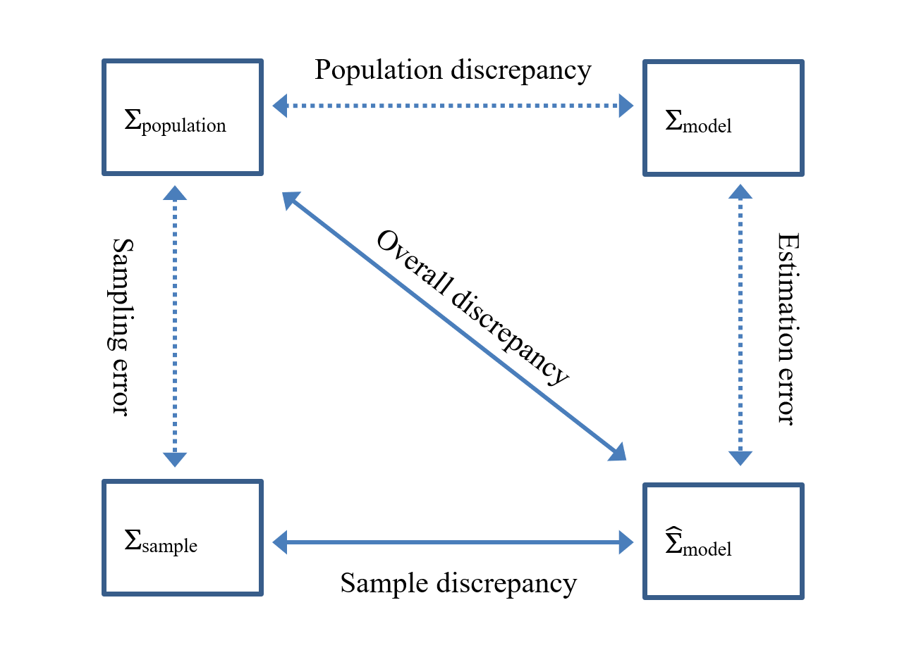
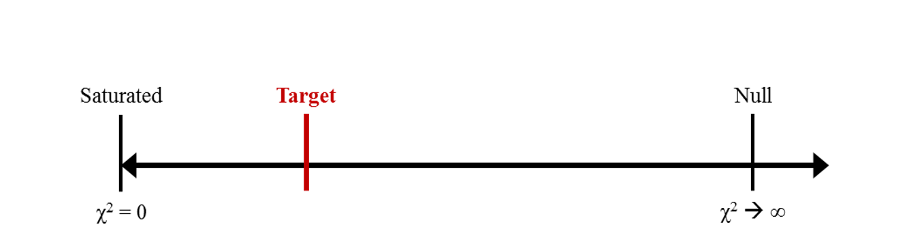

# Measures of Model Fit {#ch11}

When the model is identified, then $\mathbf{\Sigma}_\text{sample}$ can be used to derive parameter estimates that yield a covariance matrix ($\hat{\mathbf{\Sigma}}_{\text{model}}$) that is as close as possible to the observed sample covariance matrix. In general, when the discrepancies between $\mathbf{\Sigma}_\text{sample}$ and $\hat{\mathbf{\Sigma}}_{\text{model}}$ are large, this indicates that the specified model cannot give a good description of the data and therefore one might question whether the model is true in the population, i.e., whether the model is misspecified. For just-identified models, the model parameters can usually be estimated so that $\hat{\mathbf{\Sigma}}_{\text{model}}$ equals $\mathbf{\Sigma}_\text{sample}$. Evaluation of model fit is therefore uninformative. The model that is specified might not necessarily be the ‘true’ model, but there is not enough information to evaluate possible misspecification of the model as a whole. For models that are over identified (i.e., that have positive degrees of freedom) the evaluation of model fit may be informative as it can give an indication as to what extent the discrepancies between $\mathbf{\Sigma}_\text{sample}$ and $\hat{\mathbf{\Sigma}}_{\text{model}}$ can be attributed to misspecification of the model. Below we first discuss the $\chi^2$ test of ‘exact fit’, then we explain the evaluation of ‘approximate fit’, and give a short overview of other descriptive measures of model fit. We also discuss the evaluation of differences in model fit, and finally show how to obtain all these measures of model fit in `lavaan`.

## The chi-squared test of exact fit
The $\chi^2$ test of exact fit is the basic statistical evaluation of overall model fit for over-identified SEMs. It is used to evaluate the following hypothesis:

$$
\mathbf{\Sigma}_{\text{population}} = \mathbf{\Sigma}_{\text{model}}, \hspace{50mm} (\text{11.01})
$$

where $\mathbf\Sigma_{\text{population}}$ refers to the matrix of population variances and covariances of the observed variables, and $\mathbf\Sigma_{\text{model}}$ refers to the population matrix of variances and covariances as implied by the path model. $\mathbf\Sigma_{\text{model}}$ is a function of model parameters (following Equations \@ref(eq:3-09) and \@ref(eq:3-10). If the model gives a true description of reality then $\mathbf\Sigma_{\text{model}}$ is equal to the population variances and covariances $\mathbf\Sigma_{\text{population}}$. However, these population matrices cannot be directly observed and therefore their values are unknown. Instead, the matrix of observed covariances $\mathbf\Sigma_{\text{sample}}$ is taken as an estimate of the population covariance matrix, and $\hat{\mathbf\Sigma}_{\text{model}}$ is the covariance matrix as implied by model parameters derived from the sample estimates. Because the sample covariance matrix and estimated model-implied covariance matrix are only estimates of their corresponding population covariance matrices, it is possible that $\hat{\mathbf\Sigma}_{\text{population}} ≠ \hat{\mathbf\Sigma}_{\text{model}}$, even if $\mathbf\Sigma_{\text{population}} = \mathbf\Sigma_{\text{model}}$. Figure \@ref(fig:fig11-1) gives a graphical representation of the population covariance matrices ($\mathbf\Sigma_{\text{population}}$ and $\mathbf\Sigma_{\text{model}}$) and the sample covariance matrices ($\mathbf\Sigma_{\text{sample}}$ and $\hat{\mathbf\Sigma}_{\text{model}}$), and the different types of discrepancies that play a role in model fit evaluation. The term ‘sample discrepancy’ refers to the observed differences between the sample covariance matrix and the model-implied covariance matrix as derived from model parameter estimates. The term ‘population discrepancy’ refers to the differences between the population covariance matrix and the population model-implied covariance matrix. 

```{r label="fig11-1",echo = FALSE, out.width = "80%", fig.align = "center", fig.cap="Population and sample covariance matrices that play a role in model fit evaluation."}


```

The $\chi^2$ test of exact fit is based on the assumption that exact fit holds in the population, i.e., the population discrepancy is zero ($\mathbf{\Sigma}_{\text{population}} = \mathbf{\Sigma}_{\text{model}}$).  Under this null hypothesis, the $p$ value associated with the observed $\chi^2$ fit statistic gives the probability of observing a sample discrepancy (i.e., the difference between $\hat{\mathbf\Sigma}_{\text{population}}$ and $\hat{\mathbf\Sigma}_{\text{model}}$) at least as large as the observed one, when any discrepancy is due solely to random sampling error. When this probability is very low (e.g., lower than $\alpha = .05$), then we reject the null hypothesis of exact fit and conclude that the model does not hold in the population. In other words, we conclude that the model is misspecified (i.e., the population discrepancy is not zero but contains discrepancy due to misspecification).

The $\chi^2$ test of exact fit is based on the maximum likelihood (ML) discrepancy function. When all assumptions are satisfied, $(N − 1) × \text{F}_{\textsc{ML}}$ has a central $\chi^2$ distribution:

```{=tex}
\begin{equation}
\chi^2 = (N-1) \times \text{F}_\textsc{ML}
(\#eq:11-01)
\end{equation}
```

with degrees of freedom equal to

```{=tex}
\begin{equation}
df = ½ \hspace{1mm}(p \hspace{1mm} (p + 1)) - q
(\#eq:11-02)
\end{equation}
```

where $p$ is the number of observed variables and $q$ is the number of free model parameters to be estimated. If the $p$ value associated with the $\chi^2$ value is smaller than the significance level $\alpha$, the null hypothesis of exact fit (i.e., $\mathbf{\Sigma}_{\text{population}} = \mathbf{\Sigma}_{\text{model}}$) is rejected. Otherwise, the model is regarded as compatible with the population covariance matrix $\mathbf{\Sigma}_{\text{population}}$.  Note that when only the covariance structure is analysed, we use Wishart likelihood, so we multiply $\text{F}_{\text{ML}}$ by $N – 1$, but when both mean and covariance structure are analysed (e.g., when analysing raw data, or when using any robust correction), we use normal likelihood, so we multiply $\text{F}_{\text{ML}}$ by $N$.

The full mediation model of child anxiety from our illustrative example yields the following $\chi^2$ test result:

$\chi^2 = 7.429$, with $df = 2$, and associated $p$ value $= .024$.

Thus, the $\chi^2$ value is significant (at $\alpha = .05$), so we reject the null hypothesis of exact fit. 

### Alternative basis for calculating the test statistic when analysing raw data 
Equation \@ref(eq:11-01) shows how to calculate $\chi^2$ from summary statistics (i.e., observed and model-implied covariance matrices, and optionally mean vectors).  This equation only applies when analysing complete data. In practice, data are often partially observed. When some data are missing, you can use full-information maximum likelihood (FIML) estimation (review the last section of [Chapter 10](#ch10-7) for details).

We use a the log-likelihood ($\ell$)^[Recall that the log-likelihood $\ell$ for a sample is the sum of all the individual log-likelihoods ($\ell = \mathbf\Sigma\ell_i$).]  of the partially observed sample data, given the model parameters, to calculate the $\chi^2$ test statistic for the model.  We can also use $\ell$ with complete data, in which case the $\chi^2$ value is the same as it would be using equation \@ref(eq:11-01).  Although we discuss model comparison more thoroughly later in the chapter, calculating $\chi^2$ using $\ell$ implicitly involves a model comparison via a likelihood-ratio test (LRT; review the last section of [Chapter 10](#ch10-6) for details):

```{=tex}
\begin{equation}
\chi^2 = -2 \times (\ell_{\text{A}} - \ell_{\text{B}}) = -2 \ell_{\text{A}}(-2\ell_{\text{B}})
(\#eq:11-03)
\end{equation}
```

Notice that the $\chi^2$ statistic in equation \@ref(eq:11-03) is the same quantity as the LRT in equation \@ref(eq:10-06) in the [previous chapter](#ch10).  An individual model’s $\chi^2$ statistic is calculated by considering the target model as Model A, and the perfectly fitting saturated model as Model B.  If the hypothesized model is the true data-generating model, then there should be little or no difference between $\ell_{\text{Target}}$ and $\ell_{\text{Saturated}}$, so the $\chi^2$ statistic should be small (relative to its $df$).

### Testing exact fit vs. describing the degree of approximate fit
In general, a researcher usually specifies a model that he or she thinks is the ‘true’ model, and therefore is interested in obtaining a non-significant $\chi^2$ value. However, is it realistic to assume that there is an exactly ‘true’ model that satisfies the assumption of exact fit, i.e., $\mathbf{\Sigma}_{\text{population}} = \mathbf{\Sigma}_{\text{model}}$? It has been argued that it is implausible that any model that we specify is anything more than an approximation to reality (Brown & Cudeck, 1992). When we assume that the models that we specify are only an approximation of a real data-generating process, then the null hypothesis that a model fits exactly in the population is known to be false *a priori*. Even if the discrepancy is small enough to be ignored in practice (i.e., because the model is approximately correct enough to be useful), small differences between $\mathbf\Sigma_{\text{sample}}$ and $\hat{\mathbf\Sigma}_{\text{model}}$ may become statistically significant in large samples (e.g., see Equation \@ref(eq:11-01)). It has been argued that models that approximate the population covariance matrix will almost certainly be rejected under the null hypothesis of exact fit if sample size is sufficiently large (see for example Marsh, Balla, & McDonald, 1988). 

Therefore, rather than testing whether the model fits exactly in the population (when we already know the answer is no), it might be more sensible to assess the degree to which the model fits in the population. Numerous descriptive fit indices have been developed as an alternative to the $\chi^2$ test of exact fit. These descriptive fit indices do not provide a statistical significance test to assess model fit, but rather provide a descriptive evaluation of fit. Such indices are based on the idea that models are simplifications of reality and will never exactly hold in the population. Some of these fit indices take into account sample size, model parsimony, or compare the fit of the model to a baseline model. Fit indices typically have unknown sampling distributions, so they cannot be used as actual test statistics because there is no analytical way to derive a critical value^[It is possible to use simulation-based methods to generate an empirical sampling distribution with which to derive critical values and p values (see, e.g., Millsap, 2007; Pornprasertmanit, Wu, & Little, 2013).] . However, this has not stopped some researchers from proposing ‘rules of thumb’ to delineate poor and good fit—these are typically treated as critical values by applied researchers, which is not how we recommend they be used.  Rather, we recommend viewing descriptive fit indices as complementing the exact fit test in a way that is analogous to any statistical test being accompanied by a measure of effect size.  In the case of statistically significant model misfit, fit indices can be used to assess whether the degree of misfit is of practical importance. Below we explain how a number of descriptive fit indices can be derived and interpreted. 

## Root Mean Square Error of Approximation (RMSEA)
One of the earliest and most popular descriptive fit indices is the Root Mean Square Error of Approximation (RMSEA; Steiger & Lind, 1980). The rationale behind the RMSEA is that the null hypothesis of exact fit (i.e., $\mathbf{\Sigma}_{\text{population}} = \mathbf{\Sigma}_{\text{model}}$) is invariably false in practical situations. Therefore, the hypothesis of exact fit is replaced by the hypothesis of approximate fit:

```{=tex}
\begin{equation}
\mathbf{\Sigma}_{\text{population}} \approx \mathbf{\Sigma}_{\text{model}},
(\#eq:11-04)
\end{equation}
```

where it assumed that the specified model will only be an approximation to reality and thus some specification error should be allowed such that $\mathbf\Sigma_{\text{model}}$ will never be exactly equal to $\mathbf\Sigma_{\text{population}}$. However, a question that then comes up is: when do we decide that the model is a close enough approximation to reality? When we look at Figure \@ref(fig:fig11-1), the population discrepancy is not assumed to be zero under the hypothesis of approximate fit. But how large can the specification error be before a model should be rejected? To accommodate approximate fit within the context of model fit evaluation, an additional error term is introduced: the ‘error of approximation’. The error of approximation concerns the questions of how well the model with unknown but optimally chosen parameters can be expected to fit the population covariance matrix. Assuming that the model is not expected to hold exactly in the population there will always be a certain amount of approximation error. Given that the model holds approximately, the $(N − 1) × \text{F}_{\text{ML}}$ from Equation \@ref(eq:11-01) follows a noncentral $\chi^2$ distribution, with noncentrality parameter $\lambda$. Therefore, if you think that the model is an approximation of reality, you should evaluate $(N − 1) × \text{F}_{\textsc{ML}}$ against a noncentral $\chi^2$ distribution instead of a central $\chi^2$ distribution. The noncentrality parameter ($\lambda$) can be estimated using^[For all calculations in the RMSEA section, replace N − 1 with N when using normal likelihood instead of Wishart likelihood, which is only used to analyze complete-data covariance structure.]:

```{=tex}
\begin{equation}
\lambda = (N-1)\varphi_{\text{A}},
(\#eq:11-05)
\end{equation}
```

where $\varphi_{\text{A}}$ refers to the discrepancy due to approximation. Cudeck and Henly (1991) proposed that the approximation discrepancy, in turn, can be estimated with:

```{=tex}
\begin{equation}
\hat{\varphi}_{\text{A}} = \text{F}_{\textsc{ML}} - df / (N-1)
(\#eq:11-06)
\end{equation}
```

Substituting Equation 11.06 into Equation 11.05 gives an estimate of $λ$:

```{=tex}
\begin{equation}
\hat{\lambda} = (N-1) \times \text{F}_{\text{ML}} - df, \hspace{3mm} \text{or, equivalently,} \hspace{3mm} \hat{\lambda} = \chi^2 - df.
(\#eq:11-07)
\end{equation}
```

The RMSEA is a measure of approximate fit, and is computed based on the sample size, the noncentrality parameter, and $df$ of the model. The noncentrality parameter is divided by $df × (N − 1)$, which makes it less sensitive to changes in sample size, and produces a measure of misspecification per $df$. It therefore also takes model parsimony into account. The point estimate of the RMSEA is calculated as follows:


```{=tex}
\begin{equation}
\text{RMSEA} = \sqrt{\frac{\text{max}((\chi^2 - df), 0)}{df(N-1)}} = \sqrt{\frac{\text{max}\hat{\lambda},0)}{df(N-1)}}
(\#eq:11-08)
\end{equation}
```

Notice that if $\chi^2 < df$, then the RMSEA is set to zero. An RMSEA of zero indicates the model fits at least as well as would be expected if the null hypothesis of exact fit were true. In evaluating the value of the RMSEA, we accept some error of approximation. Browne and Cudeck (1992) suggested that an $\text{RMSEA} < .05$ indicates ‘close fit’, an RMSEA between .05 and .08 is thought to indicate a ‘reasonable error of approximation’, and that models with an RMSEA above .10 have poor fit.  MacCallum, Browne, and Sugawara (1996) suggested that RMSEA between .08–.10 indicates mediocre fit.

A confidence interval (CI) can be computed for RMSEA. Ideally the lower value of the 90% CI includes or is very near zero and the upper value is not very large, i.e., less than .08.  However, this is only typically achieved in practice when both of two conditions hold: large sample size and large $df$.  Kenny, Kaniskan, and McCoach (2015) show that when either of the terms in the denominator of RMSEA ($N$ or $df$; see equation \@ref(eq:11-08) above) are small, the sampling variability of RMSEA is very erratic, so it is nearly impossible to trust the estimated RMSEA in any single sample when either $N$ or $df$ are small. Unfortunately, this will almost always be the case with a path model, which typically have very small $df$ even when there are many variables, regardless of how large the sample is. So in practice, RMSEA may only be informative in latent variable models, in which many observed variables are modeled as being associated (often indirectly) via many fewer common factors.

In our illustrative example, the RMSEA value of the full mediation model is .189, with a 90% CI of .058–.343. Thus, the point estimate of the RMSEA indicates poor model fit, and the CI is very wide. The CI therefore gives an indication of the imprecision of the estimated point estimate of the RMSEA. As a comparison, the RMSEA value of the partial mediation model is 0, with a 90% CI of 0–.259. The RMSEA indicates exact fit (because this model is saturated, it fits perfectly by definition, so $\chi^2 = 0$; however, $\text{RMSEA} = 0$ in over-identified models whenever $\chi^2 < df$), but the CI shows (again) that the point estimate of RMSEA is not very precise. 

Browne and Cudeck (1992) proposed the ‘test of close fit’ where it is tested whether RMSEA is significantly greater than .05 (i.e., the null hypothesis is that if we fit our model to the population covariance matrix, RMSEA ≤ .05).  We conduct the test by constructing a CI, using a confidence level that is $2 × \alpha$ (so that we can conduct a one-sided test of our directional hypothesis using the CI).  For example, using $α = .05$ as criterion, we use a 90% CI for RMSEA.  When the lower confidence limit > .05, we can reject the null hypothesis of close fit (because the entire CI is above the .05 threshold).  MacCallum et al. (1996) extended this idea by ‘flipping’ the null hypothesis (i.e., that the population $\text{RMSEA} ≥ .05$), which they called a ‘test of not-close fit’.  When the upper confidence limit of the $\text{RMSEA} < .05$, we can reject the null hypothesis of not-close fit (because the entire CI is below the .05 threshold). Different thresholds could also be used; for example, .08 can be used to provide a ‘test of approximate fit’ or ‘not-approximate fit’. 

The only distinction between tests of close vs. not-close fit is which one you use as the null hypothesis. Recall that one very useful interpretation of a CI is that it is a range of null hypothesized values that could not be rejected using the sample data.  In our example from [chapter 7](#ch7), the partial mediation model has exact fit ($\chi^2$ and $\text{RMSEA} = 0$), but the 90% CI ranges from 0–.259, so we could not reject a null hypothesis of exact fit ($\text{RMSEA} = 0$), of close fit ($\text{RMSEA} ≤ .05$), a null hypothesis of approximate fit ($\text{RMSEA} ≤ .08$), a null hypothesis of mediocre fit ($\text{RMSEA} ≤ .10$), or a null hypothesis of poor fit ($\text{RMSEA} > .10$).  Because no possible null hypothesis could be rejected (i.e., no theory could be falsified), the RMSEA in this example is effectively useless (i.e., it is uninformative in any practical sense). As Kenny et al. (2015) indicated, this is to be expected whenever $N$ or $df$ are small.

## Other descriptive fit indices
Below, we give a short description of other popular descriptive fit indices. We limit our discussion to the fit indices that are provided by `lavaan`’s `summary()` output (which are also the indices provided by M*plus*), although many additional indices are available from `lavaan`’s `fitMeasures()` function, as well as the `moreFitIndices()` function in the `semTools` package. The information on the different fit indices is kept as concise as possible, but more detailed overviews of these (and other) fit indices can be found in other sources (e.g., Bollen, 1989; Schermelleh-Engel, Moosbrugger, & Müller, 2003; West, Taylor, & Wu, 2012).

### The Tucker–Lewis Index (TLI) and the Comparative Fit Index (CFI)
The Tucker–Lewis Index (TLI; Tucker & Lewis, 1973) and the Comparative Fit Index (CFI; Bentler, 1990) are so-called incremental fit indices (also called relative or comparative fit indices). Incremental fit indices compare the fit of the model of interest with a baseline or null model. Tucker and Lewis (1973) original developed TLI as a sort of reliability coefficient for extracting the correct number of factors in exploratory factor analysis.  However, Bentler and Bonett (1980) developed a framework for different types of incremental fit indices and illuminated their particular advantage in comparing models, which we will discuss later in this chapter.

Conceptually, incremental fit indices place a target model somewhere on a continuum between the best fitting (i.e., perfectly fitting saturated) model and the worst fitting (but still theoretically plausible) model.  Figure \@ref(fig:fig11-2) depicts this conceptual continuum, which is anchored on the left by zero because a model cannot fit better than perfectly (i.e., zero discrepancy). On the right, the null model is as poorly fitting as we can conceive being plausible (e.g., without constraining variances to equal one million for 7-point Likert scales), although greater discrepancies are possible.  If our target model is a good approximation of the true data-generating model (i.e., the “population”), then our target model should be much closer to the left-hand side of the continuum than to the right-hand side.  In general, incremental fit indices range from 0 to 1, so they could be interpreted as a proportion of the continuum in Figure \@ref(fig:fig11-2), with higher values indicating better fit.

```{r label="fig11-2", echo = FALSE, out.width = "80%", fig.align = "center", fig.cap="Continuum between poor and perfect fit."}


```

The most common choice for the baseline model is the so-called independence model, where all covariances in $\mathbf\Sigma_{\text{population}}$ are assumed zero. Although other baseline models could be used, this is not often seen in practice^[The most common requirements for specifying an alternative baseline model would be when comparing models with different levels of measurement equivalence across groups or occasions (see chapters on invariance in multiple-group and longitudinal CFA models) or when evaluating homogeneity of residual variances in a latent growth curve model (see Widamin & Thompson, 2003, for discussion).]. There are several incremental fit indices, but here we limit the discussion to the TLI and CFI because they have shown the most favourable properties in simulation research (e.g., insensitivity to sample size, sensitivity to model misspecification). The TLI, also referred to as the non-normed fit index (NNFI) by Bentler and Bonett (1980), is calculated using the $\chi^2$ and $df$ of the independence (null) and target (model) models:

```{=tex}
\begin{equation}
\text{TLI} = \frac{\frac{\chi^2_{\text{null}}}{df_{\text{null}}}-\frac{\chi^2_{\text{model}}}{df_{\text{model}}}}{\frac{\chi^2_{\text{null}}}{df_{\text{null}}}-1}
(\#eq:11-09)
\end{equation}
```

Because TLI is not normed (i.e., not forced to be within the bounds of 0 and 1), the values of the TLI will be larger than 1 whenever the target model’s $\chi^2 < df$, or may even be slightly below 0 if the target model’s $\chi^2$-to-$df$ ratio is greater than the null model’s ratio. 
 
The CFI is calculated in a very similar way as the TLI, but uses the differences between $\chi^2$ and $df$ of the null and target models (recall from equation \@ref(eq:11-07) that this difference is an estimate of the noncentrality parameter $\hat{\lambda}$):

```{=tex}
\begin{equation}
 \text{CFI} = \frac{\text{max}[0,(\chi^2_{\text{null}}-df_{\text{null}})]-\text{max}[0,(\chi^2_{\text{model}}-df_{\text{model}})]}{\text{max}[0,(\chi^2_{\text{null}}-df_{\text{null}})]} = 1-\frac{\text{max}[0,(\chi^2_{\text{model}}-df_{\text{model}})]}{\text{max}[0,(\chi^2_{\text{null}}-df_{\text{null}}),(\chi^2_{\text{model}}-df_{\text{model}})]}
(\#eq:11-10)
\end{equation}
```

In this formula, the numerator is 0 if the target model’s $\chi^2 < df$, and the denominator is equal to the numerator if the target model’s $\chi^2 < df$ or if the null model fits at least as well as the target model. This ensures that the CFI will range between 0 and 1. 

As a rule of thumb, TLI or $\text{CFI} > .90$ (Bentler & Bonett, 1980) or $> .95$ (Hu & Bentler, 1999) may be interpreted as indicative of good fit relative to the null model. TLI and CFI take model complexity into account and are relatively unaffected by samples size (Bollen, 1990; Hu & Bentler, 1998; Marsh, Balla, & McDonald, 1988; West et al., 2012).  However, they are sensitive to the size of the observed covariances. The closer the observed covariances are to zero (especially a majority), the more $\mathbf\Sigma_{\text{sample}}$ resembles the independence model, which makes it more difficult for a target model to cross the divide between the null and saturated models.

### The Root Mean Square Residual (RMR) and Standardized RMR (SRMR)
RMR (Jöreskog & Sörbom, 1981) and SRMR (Bentler, 1995) are overall badness-of-fit measures that are based on the fitted residuals (i.e., difference between model-implied and sample covariance matrices). 

```{=tex}
\begin{equation}
\text{RMR} = \sqrt{\frac{\mathbf{\Sigma}^p_{i=1}\mathbf{\Sigma}^i_{j=1}(s_{ij}-\hat\sigma_{ij})^2}{p(p+1)/2}}
(\#eq:11-11)
\end{equation}
```

RMR is defined as the square-root of the mean of the squared fitted residuals. In principle, RMR values close to zero suggest a good fit. But as the elements of $\mathbf{S}$ and $\mathbf\Sigma$ are scale dependent, the fitted residuals are scale dependent, too, which implies that RMR depends on the sizes of the variances and covariances of the observed variables. In other words, without taking the scales of the variables into account, it is virtually impossible to say whether a given RMR value indicates good or bad fit. To overcome this problem, the standardized RMR was been introduced, where the residuals $s_{ij}$ and $\hat\sigma_{ij}$ are standardized using the standard deviations of the observed variables $i$ and $j$ from the sample covariance matrix^[This is the formula used by Bentler’s (1995) EQS program.  Bollen (1989) proposed calculating SRMR from actual correlation residuals, by first standardizing the observed covariance matrix using observed variances, then standardizing the model-implied covariance matrix using model-implied variances, and taking the differences.  When the observed and model-implied variances are equal (which is typically the case), these methods produce the same result.  Currently, Mplus uses Bollen’s method for means and for off-diagonal elements (correlations, as well as for means when a mean-structure is modeled) and uses Bentler’s method for diagonal elements (variances).  All three versions are available in lavaan, with Bentler’s method being the default output.]. 

```{=tex}
\begin{equation}
\text{SRMR} = \sqrt{\frac{\mathbf{\Sigma}^p_{i=1}\mathbf{\Sigma}^i_{j=1}(s_{ij}-\hat\sigma_{ij})/(s_{ii}-s{jj})^2}{p(p+1)/2}}
(\#eq:-)
\end{equation}
```

SRMR continues to be popular despite its limitations. Interpreting SRMR is complicated by the fact that its expected value varies with sample size, but as a rule of thumb SRMR values lower than .05 are taken as indicative of good fit, and SRMR lower than .10 may be interpreted as acceptable fit.  However, we do not recommend paying attention to SRMR as a global measure of overall model fit; rather, we recommend paying attention to individual correlation residuals, as described in chapter 8 on model modification.  In that example, the average correlation residual was $\text{SRMR} = .087$, which would indicate acceptable (but not good) global fit.  However, most of the correlation residuals were zero, so the average (SRMR) masked the fact that the largest correlation residual (.272) was unacceptably large, indicating a severe local source of model misspecification.

### Information Criteria
The Akaike Information Criterion (AIC; Akaike, 1987) and so-called “Bayesian”^[The BIC is also known as Akaike's Bayesian Information Criterion (ABIC), or as the Schwarz (1978) Bayesian Criterion (SBC) after its developer.  BIC is calculated only from information about the data, without using any information from a posterior distribution, so despite its name it is not really a Bayesian quantity.  It is also not derived from information theory, so it is not really an “information” criterion either.] Information Criterion (BIC; Raftery, 1986, 1995) are fit indices that were developed specifically to compare models fit to the same data. In general, lower values indicate a better fit, so the model with the lowest value is the best fitting model after adjusting for model complexity (as measured by the number of free parameters in the model). However, the absolute value is irrelevant; only the AIC (or BIC) of one model relative to the AIC (or BIC) of another model can be meaningfully interpreted. An advantage of these fit indices is that the competing models do not need to be nested. A disadvantage is that they are based on likelihoods, so they are only available when using ML estimation (e.g., not using WLS for modelling categorical outcomes).

The values of information criteria can differ across software even when the model parameters and fit statistics are the same.  The differences are not really meaningful as they all lead to the same ordering of competing models, but they differ because there are different formulas for AIC. One formula is based on the log-likelihood of the model ($\ell$):

```{=tex}
\begin{equation}
\text{AIC} = \ell − q
(\#eq:11-13)
\end{equation}
```

where $q$ is the number of free parameters in the model. Another formula is based on $−2\ell$ (which is the one reported in `lavaan`):

```{=tex}
\begin{equation}
\text{AIC} = -2\ell + 2q
(\#eq:11-14)
\end{equation}
```

which is simple $−2$ times the formula in \@ref(eq:11-13).  Finally, AIC can also be calculated using the $\chi^2$ statistic instead of $−2\ell$ in \@ref(eq:11-14), which yields the same rank-order of candidate models because each competing model’s $\chi^2$ is calculated relative to the same saturated model (see equation \@ref(eq:11-03)).  Regardless of which formula is used, AIC penalizes models that have more free parameters (i.e., are more complex).  The rationale behind information criteria is that a model with more estimated parameters (some of which may be near zero in the population) should not be favoured over a model that may be slightly simplified but provides similar predictions as the more complex model.  AIC was developed specifically to identify which among a set of models would be expected to have the least prediction error when fitted to new samples (i.e., to identify which model generalizes best).

The BIC was derived based on Bayesian theory (an alternative to classical “frequentist” hypothesis testing) as a rough approximation of the log of a Bayes factor (the Bayesian analogue of a LRT) comparing the target model to the saturated model. The resulting index is similar to the AIC, but the penalty against complex models increases as sample size increases:

```{=tex}
\begin{equation}
\text{BIC} = -2\ell + \log(N) \times q
(\#eq:11-15)
\end{equation}
```

where $\log(N)$ is the natural logarithm of the number of cases in the sample.  Similar to AIC, an alternative calculation of BIC would be to use $\chi^2$ instead of $−2\ell$ in equation \@ref(eq:11-15), which provides identical rank-ordering of competing models.

Simulations have shown that BIC tends to select the true model if it is in the set of competing models (which may never be true in practice), whereas the AIC tends to select the model that makes the most accurate predictions about new samples, regardless of whether the true model is in the candidate set.  They both perform better with larger samples, so small-sample adjustments have been proposed.  The Sample-Size Adjusted BIC (SABIC; Sclove, 1987) uses $\log(\frac{N+2}{24})$) instead of $\log(N)$ in equation\@ref(eq:11-14), which places a smaller emphasis on parsimony.  In contrast, the corrected AIC (AICc; Burnham & Anderson, 2003) adds $\frac{2q(q+1)}{(N-q-1)}$ to AIC (as defined in equation \@ref(eq:11-14)), placing even greater emphasis on parsimony.  This is necessary because in small samples, AIC is more likely to select a model that overfits to sample nuances, reducing its generalizability.

## A note on using available fit indices
There exists considerable controversy concerning the use of fit indices. Some researchers do not believe that descriptive fit indices are of much added value, and that the $\chi^2$ test of exact fit should be the only substantive test of model fit applied (e.g., Barrett, 2007). Another problem is that with so many different alternative fit indices to choose from, one might be tempted to choose to report only those indices that support your model, based on arbitrary rules-of-thumb. This might result in too many misspecified models being reported as ‘acceptable’ models. Also, some argue that cutoffs for a descriptive fit index can be misleading as these descriptive fit indices are then wrongfully treated as actual test statistics (e.g., Hayduk, Cummings, Boadu, Pazderka-Robinson, & Boulianne, 2007). Some researchers have argued that a specific combination of descriptive fit indices should be preferred for model evaluation (e.g., Hu & Bentler, 1999).  In general, it could be recommended to inspect and report several descriptive fit indices, in addition to the $\chi^2$ test, but that the researcher should be aware that choice of the specific fit index might depend on the specifics of the data (e.g., sample size) or model (e.g., complexity) and the specific goal of model evaluation (e.g., confirmatory versus exploratory, comparing competing (non)nested models, model parsimony, explanatory power, etc.). Several papers discuss recommendations for the use of the different fit indices described above (and several others) and their potential problems (e.g., see Schermelleh-Engel, Moosbrugger & Müller, 2003; Hu & Bentler, 1999; Marsh, Hau & Wen, 2004). Most importantly, as a researcher one should not forget that substantive theory-relevant criteria can (and should always) play a major role in the evaluation of model fit (e.g., Barret, 2007; Hayduk, et al., 2007).

## Difference in model fit
In applications of covariance structure analysis, researchers often face the problem of choosing among two or more alternative models. The choice of which measure to use for selecting one of several competing models depends on whether or not the models are nested. A specific model (Model A) is said to be nested within a less restricted model (Model B) with more parameters (i.e., fewer $df$) than Model A, if Model A can be derived from Model B only by introducing restrictions. For example, by fixing free parameters in Model B or by constraining a free parameter to equal to one or more other parameters. This is known as *parameter nesting*^[There is also a more general concept of covariance matrix nesting (Bentler & Bonett, 1980), which simply states that if a less restrictive model (B) can fit perfectly to the same (or larger) set of covariance matrices than a more restrictive model (A) can, then A is nested within B.  Covariance matrix nesting includes the special case of parameter nesting, but also includes situations where nested models have very different forms, so they do not have an equivalent set of parameters to estimate.]: any two models are nested when the free parameters in the more restrictive model are a subset of the free parameters in the less restrictive model.  Additionally, if A and B have the same $df$, then they are *equivalent* models, which is a special case of nesting.

As the test statistic of each of the nested models follows a $\chi^2$ distribution, the difference in $\chi^2$ values between two nested models is also $\chi^2$ distributed: 

```{=tex}
\begin{equation}
\Delta\chi^2= \chi_A^2 - \chi_B^2 ,
(\#eq:11-16)
\end{equation}
```

with df for the difference equal to the difference in df for the two models:

```{=tex}
\begin{equation}
\Delta df = df_A - df_B
(\#eq:11-17)
\end{equation}
```

Thus, testing the difference in model fit can be tested comparing $\Delta\chi^2$ to a $\chi^2$ distribution with $\Delta df$, which is called the $\chi^2$ difference test. If $\Delta\chi^2$ is significant, the null hypothesis of equal fit for both models is rejected, so the less restrictive Model B should be retained. But if $\Delta\chi^2$ is not significant, the fit of the restricted model (Model A) is not significantly worse than the fit of the unrestricted model (Model B), so the null hypothesis of equal fit cannot be rejected. On the parsimony principle (Occam’s razor), we should favour the more restrictive (i.e., simpler) Model A.

In our illustrative example of child anxiety, the difference in model fit between the full mediation model (Model A) and the partial mediation model (Model B) is:
$$
\Delta\chi^2= \chi_A^2-\chi_B^2 = 7.429 – 0.402 = 7.027,
$$
$$
\text{with} \hspace{2mm} \Delta df = df_A - df_B = 2 – 1 = 1 .
$$

The associated $p$ value is .008, indicating that the difference in model fit is significant at $α = .05$. The fit of the full mediation model is significantly worse than the fit of the partial mediation model, so we would favour the latter model.

Likewise, a single target model’s $\chi^2$ statistic can be thought of as a $Delta\chi^2$ statistic using equations \@ref(eq:11-16) and \@ref(eq:11-17), where Model B is replaced with the saturated Model S. In our illustrative example of child anxiety the overall $\chi^2$ is then obtained by:
$$
\Delta\chi^2 = \chi_A^2 - \chi_S^2 = \chi_A^2 - 0 = 7.429 – 0 = 7.429 , 	
$$
$$
\text{with} \hspace{2mm} \Delta df = df_A - df_S = df_A - 0 = 2 - 0 = 2.
$$

### $\Delta\chi^2$ as a likelihood ratio test
Recall from equation 11.03 that a model’s $\chi^2$ statistic is the LRT from equation 9.06, treating the target model as Model A and the saturated model as Model B.  The $\Delta\chi^2$ test is also a log-likelihood ratio, so equation 11.15 could equivalently be calculated using equation 11.03.  The reason the two equations yield the same result is that each model’s $\chi^2$ statistic is calculated using the same saturated model’s log-likelihood ($\ell_S$), so they cancel out. Labelling the saturated model as Model S instead of B in equation 11.03, the LRT for two nested hypothetical Models A (in \color{green}{green}) and B (in \color{blue}{blue}) could be calculated using each of their LRT statistics:

\begin{align*}
\Delta\chi^2 & =  \color{green}{[-2\ell_A-(-2\ell_S )]}-\color{blue}{[-2\ell_B-(-2\ell_S )]} \\
& =\color{green}{-2\ell_A}+\color{red}{2\ell_S}+\color{blue}{2\ell_B}-\color{red}{2\ell_S} \\
& =\color{green}{-2\ell_A}+\color{blue}{2\ell_B} \\
& =\color{green}{-2\ell_A}-\color{blue}{(-2\ell_B )}
\end{align*}

### Describing differences in fit
The $\chi^2$ difference test applied to nested models has essentially the same strengths and weaknesses as the $\chi^2$ test applied to any single model; namely, trivial differences can be detected as statistically significant in large samples.  Thus, a researcher may supplement the significance test for difference in fit by reporting a difference in a descriptive fit index.  In the case of RMSEA, equation \@ref(eq:11-08) can actually be applied to $\Delta\chi^2$ and $\Delta df$ instead of $\chi^2$ and $df$.  This was proposed as the Root Deterioration per Restriction (RDR), but it never became popular because it behaved so erratically.  Recall that the RMSEA itself performs very poorly when either $N$ or $df$ are small, which explains why RDR performs so poorly: rarely will two models be compared that have a very large difference in $df$ ($\Delta df$).

Instead, $\Delta\text{CFI}$ has become very popular, particularly when testing measurement equivalence across groups or occasions (we will discuss this later in the course).  However, these fit indices have unknown sampling distributions, they should not be used as test statistics^[Unless an empirical sampling distribution can be derived, for example, using bootstrapping, permutation, or Monte Carlo simulation.], but rather as a kind of effect size that would typically accompany a significance test.  Analogously, when using a t test to compare means, small differences might be statistically significant in large samples, so Cohen’s $d$ is used to indicate whether the observed difference is of practical importance.  Unfortunately, there are few guidelines for what would constitute a meaningful difference in CFIs between models, and the few proposed rules-of-thumb have been made for very specific situations (e.g., measurement invariance).

Incremental fit indices in general have the advantage of being able to compare models regardless of whether they are nested (Bentler & Bonett, 1980).  This is because all possible competing models are nested within the same saturated model, by definition.  So as long as a single null model is specified *that is nested within each candidate model*^[The default independence model might not be nested within each competing model (Widamin & Thompson, 2003).],  calculating the CFI for each candidate models allows us to see where each competing model lies on the same continuum between poor and perfect fit.  Supposing we have three candidate models, the one with the largest CFI is the one furthest to the left in Figure \@ref(fig:fig11-3) (i.e., Target Model 3):

```{r label="fig11-3", echo = FALSE, out.width = "80%", fig.align = "center", fig.cap="Placing competing models on the same continuum." }

knitr::include_graphics("images/Ch11_competing_models.png")
```

Because CFI and TLI implicitly account for model complexity by using the model’s $df$ to adjust the model’s fit (using the noncentrality parameter and the $\chi^2$-to-$df$ ratio, respectively), the continuum in Figure \@ref(fig:fig11-3) represents complexity-adjusted fit.  

The model with the lowest AIC (or BIC) could also be selected as the model that best balances fit and parsimony.  This model-selection procedure has typically been used in place of a $\chi^2$ difference test when the models are not nested; however, this procedure does not take sampling variability into account, so it is not truly a test of (comparative) model fit.  Furthermore, simply choosing the lowest AIC suffers the same limitation as choosing the highest CFI—it is unclear what constitutes a meaningful difference in values between two models.

### Testing differences in fit between non-nested models
Test statistics have also been developed for non-nested models (Merkle, You, & Preacher, 2016).  If each individual log-likelihood $\ell_i$ is calculated under Model A and under Model B, then the difference between individual $i$’s log-likelihoods ($\Delta\ell_i$) reveals which model most likely “generated” this person’s observed data.  A weighted sum of these $\Delta\ell_i$ is an asymptotically normally distributed statistic, with a $\mu = 0$ if the null hypothesis of equal fit is true, so it can be used to conduct a $z$ test.  A significant test indicates that Model A fits better than Model B (if the statistic is positive) or vice versa (if the statistic is negative); otherwise there is not enough evidence to prefer one model over another. This is called the Vuong test after its developer (Vuong, 1989, as cited in Merkle et al., 2016).

We can also use the variability of $\Delta\ell_i$ to calculate a 95% CI (assuming $α = .05$) for the difference between two model’s AICs (or BICs).  This provides a test of fit that takes model parsimony into account. Assuming the null hypothesis of equal complexity-adjusted fit is true, $\Delta\text{AIC}$ (or $\Delta\text{BIC}$) is zero in the population.  Testing this null hypothesis is as simple as checking whether the 95% CI for $\Delta\text{AIC}$ (or $\
$\Delta\text{BIC}$ includes zero.  If so, you cannot reject the null hypothesis.  Otherwise, the model with the lower AIC (or BIC) should be preferred.

Because the Vuong test and CIs for information criteria area calculated from individual $\Delta\ell_i$, they can only be calculated when using MLE to fit the model to complete data that are multivariate normally distributed.  Furthermore, they cannot be used if you only have access to summary statistics (like most of our teaching examples), which is rarely a problem in practice.  Although it is theoretically possible to extend the Vuong test to least-squares estimators (e.g., WLS for categorical outcomes), this extension has yet to be developed (Merkle et al., 2016).  Because these tests have only recently begun being investigated in an SEM framework, more research is needed to see how robust they are when data deviate from multivariate normality (i.e., when $\ell_i$ are calculated using equation \@ref(eq:10-05) even though data do not follow the distribution described by \@ref(eq:10-04)). 

## Request fit measures in `lavaan`
The `summary()` function has an argument to request information about model fit from the lavaan output:

```
summary(AWmodelOut, fit.measures = TRUE)
```

Notice that `lavaan` will print the $\chi^2$ test for both the target model and the default baseline model (i.e., the independence model), as well as RMSEA (including a 90% CI), CFI and TLI, SRMR (and WRMR when outcomes are categorical), and information criteria when using MLE (specifically, AIC, BIC, and SABIC).  Several other fit indices are available from two different functions.  The first is `lavaan`’s function `fitMeasures()`.  The default is to print all available fit measures:

```
fitMeasures(AWmodelOut)
```

But there are too many to easily read.  It is better to request only the fit measures you want to see (e.g., when you want to calculate changes such as $\Delta\text{CFI}$):

```
myFitIndices <- c("chisq","df","pvalue","cfi","aic")
fitMeasures(AWmodelOut, fit.measures = myFitIndices)
```

The function `moreFitIndices()` is available in the `semTools` package, and it provides a few other options, such as AICc (labelled "`aic.smallN`"): 

```
library(semTools)
moreFitIndices(AWmodelOut, fit.measures = "aic.smallN")
```

### Compare fit of lavaan models
Consider the difference in fit between the original path model for the development of child anxiety from [Chapter 3](#Ch3) and the less constrained model with the additional direct effect from Parent Anxiety to Child Anxiety from [Chapter 8](#Ch8). You can use the `anova()` function, providing both models as arguments. The order of models does not matter because `lavaan` will sort them in order of increasing df automatically.

```
anova(AWmodelOut, AWmodel2Out) 
```

The function `lavTestLRT()` is used the same way as `anova()`, but it has some more options (mainly, what adjustment to use if data are not normally distributed).  In fact the anova() function merely calls `lavTestLRT()` with all its default arguments.  Using either function, the output would be:

```
Chi Square Difference Test
            Df    AIC    BIC  Chisq Chisq diff Df diff Pr(>Chisq)   
AWmodel2Out  1 2138.5 2159.6 0.3972                                 
AWmodelOut   2 2143.5 2162.3 7.3327     6.9355       1    0.00845 **
---
Signif. codes:  0 ‘***’ 0.001 ‘**’ 0.01 ‘*’ 0.05 ‘.’ 0.1 ‘ ’ 1
```

Notice that the actual $\Delta\chi^2$ (6.9355) is very similar to the expected $\Delta\chi^2$ indicated by the modification index for this additional parameter (6.716) in [Chapter 8](#Ch8), Table 2.  Also, the AIC and BIC for each model are displayed.  The `anova()` function is not suitable for comparing non-nested models, so if your models are not nested, you can simply use a function to request AIC or BIC:

```
AIC(AWmodelOut, AWmodel2Out) 
BIC(AWmodelOut, AWmodel2Out) 
```

Note that these functions output a column labeled `df`, which is actually the number of free model parameters, not the model’s $df$.  In order to actually test differences in fit of non-nested models, use functions that are available in the R package `nonnest2`.  Suppose that in our examples, we had actually fit our models to raw data.  The following functions would allow us to run the Vuong test (analogous to $\Delta\chi^2$ test for non-nested models):

```
library(nonnest2)
vuongtest(AWmodelOut, AWmodel2Out)
```

Or we could test differences in parsimony-adjusted fit using CIs for $Delta\text{AIC}$ or $Delta\text{BIC}$:

```
icci(AWmodelOut, AWmodel2Out, conf.level = 0.95)
```

CIs for both $\Delta\text{AIC}$ and $Delta\text{BIC}$ would be provided, but you should only use one or the other, based upon whether you can assume one of the models is “correct” (BIC) or whether you merely wish to find the most generalizable model (AIC).  Note, again, that these tests require analysing the raw data, not summary statistics.  

### Fit measures in `lavaan` when adjusting for non-normal data
When correcting for non-normality, `lavTestLRT()` and `anova()` automatically calculate the correct adjusted $\Delta\chi^2$ test.  However, the default method (`"satorra.bentler.2001"`) can sometimes yield a negative test statistic, in which case it is impossible to compute a $p$ value.  If this happens, you can use a version of the test that will always yield a positive scaled test statistic:

```
lavTestLRT(AWmodelOut, AWmodel2Out, method = "satorra.bentler.2010") 
```

When correcting for non-normality, the `summary(..., fit.measures = TRUE)` output includes a second column labelled “`Robust`” that contains the scaled $\chi^2$ test results, as well as robust versions of RMSEA, CFI, and TLI that incorporate the scaling factor to adjust for non-normality.  The other fit measures (AIC, BIC, and SRMR) are unaffected by the adjustment, so those values are identical in the two columns.  The left column of unadjusted measures can be ignored, but it is included for the sake of comparison.

However, when you use the `fitMeasures()` function, you will see not only the unadjusted fit measures, but also two different copies of any measure based on the $\chi^2$ statistic.  The first set are labelled with a suffix “`.scaled`”, which corresponds to the corrected $\chi^2$ statistic. For RMSEA, TLI, and CFI (which are based on $\chi^2$), “.scaled” indicates that they were calculated naïvely by simply plugging the scaled $\chi^2$ statistic ("`chisq.scaled`") into equations \@ref(eq:11-08), \@ref(eq:11-09), and \@ref(eq:11-10), respectively.  However, using those formulas with simple substitutions would yield fit measures that do not, on average, equal their population-level counterparts (i.e., if models were fit to $\mathbfΣ_{\text{population}}$ and adjusted for non-normality using population information).  Instead, special formulas were developed by Brosseau-Liard and colleagues (2012, 2014) to yield consistent sample values of these three fit indices.  These are labelled with a suffix “`.robust`”, they are the ones displayed in the `summary()` output, and they are the ones you should request from `fitMeasures()`: 

```
myFitIndices <- c("chisq.scaled","df","pvalue.scaled","cfi.robust","aic")
fitMeasures(AWmodelOut, fit.measures = myFitIndices)
```

Likewise, the output of `modificationindices()` will contain a column “`mi.scaled`”.  If you are comparing MIs to a critical value, this is the column you should pay attention to.

### Test statistic adjusted for small sample size
One last issue is that the $(\Delta)\chi^2$ statistic is only asymptotically (i.e., as $N \rightarrow \infty$) distributed as a $\chi^2$ random variable.  In finite samples, it is approximately distributed as a $\chi^2$ random variable, but in small samples the approximation is poor.  In this case, your p values will be incorrect because the $(\Delta)\chi^2$ statistic will be too big, suggesting that the model fits worse than it actually does.  It is simple to correct for this by multiplying the observed $(\Delta)\chi^2$ statistic by a correction factor $c$^[Replace the $N$ in the denominator with $N − 1$ when using Wishart likelihood for modelling covariance structure only.]:

```{=tex}
\begin{equation}
c=1-\frac{2p+4k+5}{6N} ,
(\#eq:11-18)
\end{equation}
```

where $p$ is the number of observed variables, $k$ is the number of factors, and $N$ is the sample size (Nevitt & Hancock, 2004).  Note that in a path model, $k = 0$, reducing the numerator to $2p + 5$.  The multiplicative correction will typically be ≤ 1, so it will usually make $\chi^2$ smaller, reducing the inflated Type I error rate in small samples.  This correction will be small whenever the denominator in \@ref(eq:11-18) ($N$) is large, although how large depends on the size of the model.  For example, models with more variables ($p$ and $k$) have a larger numerator, requiring larger $N$ to overcome the inflation of $\chi^2$. 

When data are normal, you simply multiply the $\chi^2$ statistic by $c$ and calculate a $p$ value for the corrected statistic:

```
N <- lavInspect(fit, "ntotal") # subtract 1 if likelihood = "wishart"
P <- length(lavNames(AWmodelOut, type = "ov")) # count observed variables
K <- length(lavNames(AWmodelOut, type = "lv")) # count latent factors
cc <- 1 - ((2*P + 4*K + 5) / (6*N)) # correction factor
(chi <- fitMeasures(AWmodelOut, "chisq"))
(DF <- fitMeasures(AWmodelOut, "df"))
(pValue <- pchisq(chi*cc, DF, lower.tail = FALSE))
```

When adjusting for non-normality (in which case the model must be fit to raw data instead of summary statistics), you simply multiply the scaled $\chi^2$ statistic by $c$ and calculate a $p$ value for the corrected statistic.

```
chi <- fitMeasures(AWmodelOut, "chisq.scaled") # nothing else changes
```

When correcting the $Delta\chi^2$ statistic for model comparison, you can extract the $Delta\chi^2$ statistic from the `anova()` output, which will already be the scaled $\Delta\chi^2$ when adjusting for non-normality.  The $\Delta df$ can also be extracted from the output.
```
AOV <- anova(AWmodelOut, AWmodel2Out)
chi <- AOV[["Chisq diff"]][2]
DF <- AOV[["Df diff"]][2]
```

Although the calculation of `cc` will not be affected by sample size or number of variables (because both models must be fit to the same sample people and variables), the number of factors $k$ may differ between nested models.  In this case, it is probably best to choose the larger $k$ between the two models, because the model with fewer factors is statistically equivalent to the model with more factors if the factor variances were constrained to equality and factor correlations were constrained to 1 (i.e., if the factors are the same variable).  This typically works in our favour because choosing the larger $k$ will also decrease the $\chi^2$ more, so the model will appear to fit better.


## References {-}
Akaike, H. (1987). Factor analysis and AIC. *Psychometrika, 52*, 317–332. doi:10.1007/BF02294359

Barret, P. (2007). Structural equation modelling: Adjudging model fit. *Personality and Individual Differences, 42*(5), 815–824. doi:10.1016/j.paid.2006.09.018

Bentler, P. M. (1990). Comparative fit indexes in structural models. *Psychological Bulletin, 107*(2), 238–246. doi:10.1037/0033-2909.107.2.238

Bentler, P. M. (1995). *EQS structural equations program manual*. Encino, CA: Multivariate Software.

Bentler, P. M., & Bonett, D. G. (1980). Significance tests and goodness of fit in the analysis of covariance structures. *Psychological Bulletin, 88*(3), 588–606. doi:10.1037/0033-2909.88.3.588

Bollen, K. A. (1989). *Structural equations with latent variables.* Hoboken, NJ: Wiley

Bollen, K. A. (1990). Overall fit in covariance structure models: two types of sample size effects. *Psychological Bulletin, 107*(2), 256–259. doi:10.1037/0033-2909.107.2.256

Brosseau-Liard, P. E., Savalei, V., & Li, L. (2012). An investigation of the sample performance of two nonnormality corrections for RMSEA. *Multivariate Behavioral Research, 47*(6), 904–930. doi:10.1080/00273171.2012.715252

Brosseau-Liard, P. E., & Savalei, V. (2014). Adjusting incremental fit indices for nonnormality. *Multivariate Behavioral Research, 49*(5), 460–470. doi:10.1080/00273171.2014.933697

Browne, M. W., & Cudeck, R. (1989). Single sample cross-validation indices for covariance structures. *Multivariate Behavioral Research, 24*(4), 445–455. doi:10.1207/s15327906mbr2404_4

Browne, M. W., & Cudeck, R. (1992). Alternative ways of assessing model fit. *Sociological Methods & Research, 21*, 230–258. doi:10.1177/0049124192021002005

Burnham, K., & Anderson, D. (2003). *Model selection and multimodel inference: A practical-theoretic approach.* New York, NY: Springer-Verlag.

Cudeck, R., & Henly, S. J. (1991). Model selection in covariance structures analysis and the "problem" of sample size: A clarification. *Psychological Bulletin, 109*(3), 512–519. doi:10.1037/0033-2909.109.3.512

Hayduk, L., Cummings, G., Boada, K., Pazderka-Robinson, H., & Boulianne, S. (2007). Testing! testing! one, two, three—Testing the theory in structural equation models! *Personality and Individual Differences, 42*, 841–850. doi:10.1016/j.paid.2006.10.001

Hu, L.-t., & Bentler, P. M. (1998). Fit indices in covariance structure modeling: Sensitivity to underparameterized model misspecification. *Psychological Methods, 3*(4), 424–453. doi:10.1037/1082-989X.3.4.424

Hu, L.-t., & Bentler, P. M. (1999). Cutoff criteria for fit indexes in covariance structure analysis: Conventional criteria versus new alternatives. *Structural Equation Modeling, 6*(1), 1–55. doi:10.1080/10705519909540118

Jöreskog, K. G., & Sörbom, D. (1981). *LISREL V: Analysis of linear structural relationships by maximum likelihood*. Chicago: National Educational Resources.

Kenny, D. A., Kaniskan, B., & McCoach, D. B. (2015). The performance of RMSEA in models with small degrees of freedom. *Sociological Methods & Research, 44*(3), 486–507. doi:10.1177/0049124114543236

MacCallum, R. C., Browne, M. W., & Sugawara, H. M. (1996). Power analysis and determination of sample size for covariance structure modeling. *Psychological Methods, 1*(2), 130–149. doi:10.1037//1082-989X.1.2.130

Marsh, H. W., Balla, J. R., & McDonald, R. P. (1988). Goodness of fit indexes in confirmatory factor analysis: The effect of sample size. *Psychological Bulletin, 103*, 391–410. doi:10.1037/0033-2909.103.3.391

Marsh, H. W., Hau, K.-T., & Wen, Z. (2004). In search of golden rules: Comment on hypothesis-testing approaches to setting cutoff values for fit indexes and dangers in overgeneralizing Hu & Bentlers’ (1999) findings. *Structural Equation Modeling, 11*, 320–341. doi:10.1207/s15328007sem1103_2

Merkle, E. C., You, D., & Preacher, K. J. (2016). Testing nonnested structural equation models. *Psychological Methods, 21*(2), 151–163. Advance online publication. doi:10.1037/met0000038

Millsap, R. E. (2007). Structural equation modeling made difficult. *Personality and Individual Differences, 42*(5), 875–881. doi:10.1016/j.paid.2006.09.021

Nevitt, J., & Hancock, G. R. (2004). Evaluating small sample approaches for model test statistics in structural equation modelling. *Multivariate Behavioral Research, 39*(3) 439–478.  doi:10.1207/S15327906MBR3903_3

Pornprasertmanit, S., Wu, W., & Little, T. D. (2013). A Monte Carlo approach for nested model comparisons in structural equation modeling. In R. E. Millsap, L. A. van der Ark, D. M. Bolt, & C. M. Woods (Eds.), *New developments in quantitative psychology* (Vol. 66, pp. 187–197). New York, NY: Springer. doi:10.1007/978-1-4614-9348-8_12

Raftery, A. E. (1986). Choosing models for cross-classification. *American Sociological Review, 51*(1), 145–146.

Raftery, A. E. (1995). Bayesian model selection in social research. *Sociological Methodology, 25*, 111–163.

Schermelleh-Engel, K., Moosbrugger, H., & Müller, H. (2003). Evaluating the fit of structural equation models: Tests of significance and descriptive goodness-of-fit measures. *Methods of Psychological Research Online, 8*(2), 23–74.

Sclove, S. L. (1987). Application of model-selection criteria to some problems in multivariate analysis. *Psychometrika, 52*, 333–343. doi:10.1007/BF02294360

Steiger, J. H., & Lind, J. (1980). *Statistically based tests fort the number  of common factors*. Paper presented at the annual meeting of the Psychometric Society, Iowa City.

Tucker, L. R., & Lewis, C. (1973). A reliability coefficient for maximum likelihood factor analysis. *Psychometrika, 38*, 1–10. doi:10.1007/BF02291170

West, S. G., Taylor, A. B., & Wu, W. (2012). Model fit and model selection in structural equation modeling. In R. H. Hoyle (Ed.), *Handbook of structural equation modeling* (pp. 209–231). New York, NY: Guilford.

Widaman, K. F., & Thompson, J. S. (2003). On specifying the null model for incremental fit indices in structural equation modeling. *Psychological Methods, 8*(1), 16–37. doi:10.1037/1082-989X.8.1.16


