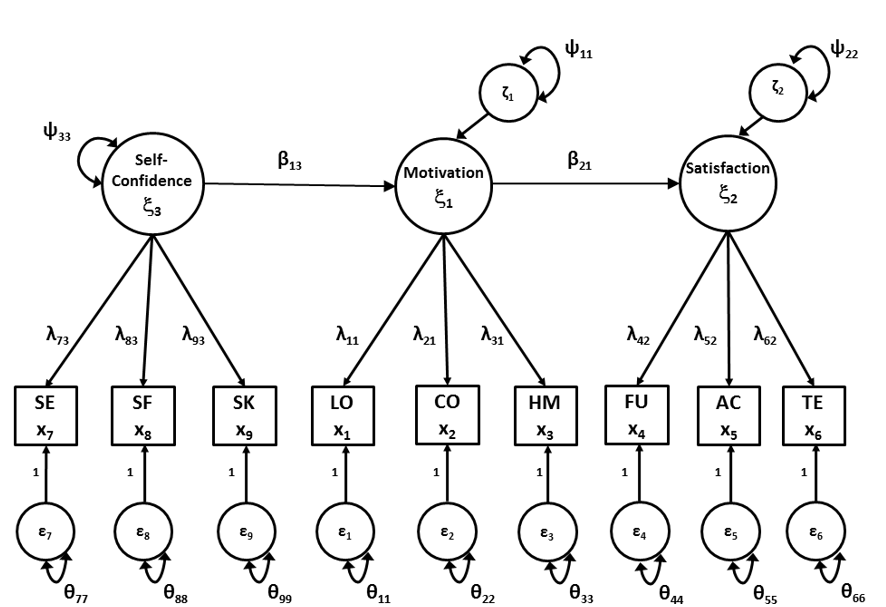

# Structural Regression Models {#ch18}

The name “structural regression” model or SR model refers to a path model with latent variables. Just as in a second-order factor analysis model, an SR model imposes a structure on the covariances in Φ. In the SR model, Φ has the structure of a path model: Φ = (I - Β)-1 Ψ (I - Β)-1t. Here, B is a full matrix with the direct effects between the common factors, Ψ denotes a symmetric matrix with variances and covariances of the exogenous and disturbances of endogenous factors, and I is an identity matrix. As both path analysis and factor analysis are applied with this type of model, it is also referred to as “full SEM”.

[Script 18.1](#script-18.1) fits an SR model to the SAQ data from [Chapter 14](#ch14). Instead of having all three latent variables correlate with each other, we hypothesize that Self-confidence about ones scholastic capabilities affects Motivation for school tasks, which in turn affects Satisfaction with school life. This model is depicted in Figure \@ref(fig:fig18-1). Note that the order of the common factors has been switched in the figure, so that the exogenous common factor is on the left side. All symbols in the figure refer to the parameters of the model. 

```{r label="fig18-1", echo = FALSE, out.width = "80%", fig.align = "center", fig.cap="Structural Regression model for the School Attitudes Questionnaire." }


```
### Script 18.1 {-}
```
## specify SR model
saqmodelSR <- '
	# MEASUREMENT PART
	# regression equations
	Motivation =~ L11*learning + L21*concentration + L31*homework
	Satisfaction =~ L42*fun + L52*acceptance + L62*teacher
	SelfConfidence =~ L73*selfexpr + L83*selfeff + L93*socialskill

	# residual variances observed variables 
	learning ~~ TH11*learning
	concentration ~~ TH22*concentration
	homework ~~ TH33*homework
	fun ~~ TH44*fun
	acceptance ~~ TH55*acceptance
	teacher ~~ TH66*teacher
	selfexpr ~~ TH77*selfexpr
	selfeff ~~ TH88*selfeff
	socialskill ~~ TH99*socialskill

	# scaling constraints
	L11 == 1
	L42 == 1
	L73 == 1

	# STRUCTURAL PART
	# regression equations
	Motivation ~ b13*SelfConfidence
	Satisfaction ~ b21*Motivation

	# (residual) variances common factors
	Motivation ~~ p11*Motivation
	Satisfaction ~~ p22*Satisfaction
	SelfConfidence ~~ p33*SelfConfidence
	'

## run model
saqmodelSROut <- lavaan(saqmodelSR, sample.cov = saqcov, 
                        sample.nobs = 915, likelihood = "wishart")
## output
summary(saqmodelSROut)
```

The first part of the script is equal to the script of the usual factor model. Here we define the common factors. This is the measurement part of the full SEM model, where we define which observed indicators load on which common factor. 

The measurement part of the model consists of the regression equations that define the common factors (matrix $\mathbfΛ$) and the residual variances of the observed indicators (matrix $\mathbfΘ$). Because matrix $\mathbfΦ$ is not directly specified, (as with second-order CFA), we scale the common factors by fixing the first factor loading of each common factor to 1. 

The $\mathbfΦ$ matrix has the structure of a path model. Thus, we do not directly define parameters $\mathbfΦ$, but instead define the parameters of the path model (matrix $\mathbf{B}$ and $\mathbfΨ$). We call this the structural part of the full SEM model. In the full SEM model the path model describes the relationships between the common factors instead of between the observed variables. We use regression equations to specify the effects between the common factors (matrix $\mathbf{B}$). In our example, Motivation is regressed on `SelfConfidence`, and `Satisfaction` is regressed on `Motivation.` 

```
		# STRUCTURAL PART
# regression equations
		Motivation ~ b13*SelfConfidence
		Satisfaction ~ b21*Motivation
```

In addition to the parameters of the $\mathbf{B}$ matrix, we define the parameters of the $\mathbfΨ$ matrix that contains the variances of the exogenous common factors, the residual variances of the endogenous factors and possibly the covariances between the exogenous factors and/or disturbances of the endogenous factors. In our example, there is only one exogenous factor and no disturbance covariances, so we only need to specify the (residual) variances of the common factors.

```
		# (residual) variances common factors
		Motivation ~~ p11*Motivation
		Satisfaction ~~ p22*Satisfaction
		SelfConfidence ~~ p33*SelfConfidence
```

We have now defined all parameter estimates of $\mathbfΛ, Θ, Β$, and $\mathbfΨ$ that need to be estimated for our structural regression model. When we run our model and inspect the output using the `summary()` function we will get three blocks of parameter estimates, first the “Latent variables”, where the factor loadings are given, then the “Regressions” where the direct effects between the common factors are given, and finally the “Variances” where both residual variances of the observed indicators as the (residual) variances of the common factors are given. Part of the output is given below.

```
                   Estimate  Std.err  Z-value  P(>|z|)
Regressions:
  Motivation ~
    SlfCnfd (b13)     0.444    0.033   13.572    0.000
  Satisfaction ~
    Motivtn (b21)     0.723    0.038   18.783    0.000
```
In our example, there is a significant effect of Self-confidence on Motivation, where a higher Self-confidence leads to a higher motivation. There is also a significant effect of Motivation on Satisfaction, where a higher Motivation leads to a higher Satisfaction. 

The [code below](#script-18.2) can be used to obtain the parameter estimates in matrix form. In the standard structural regression model, the parameter matrices in `lavaan` match the matrices that we use. We arrange the matrices in the desired using a vector of the names of the common factors. 

### Script 18.2 {-}
```
# Extract list with parameter matrices
Estimates <- lavInspect(saqmodelSROut, "est")
factornames <- c("Motivation","Satisfaction","SelfConfidence")

# Reorder parameter matrices and store them in separate objects 
lambda <- Estimates$lambda[obsnames, factornames]
theta <- Estimates$theta[obsnames, obsnames]
beta <- Estimates$beta[factornames, factornames]
psi <- Estimates$psi[factornames, factornames]
iden <- diag(1, nrow(beta))

# Calculate model-implied covariance matrix of factors (phi)
phi <- solve(iden-beta) %*% psi %*% t(solve(iden-beta))
```
Notice that the common factor variances and covariances (`phi`) are not estimated directly, but instead are a function of parameter estimates of the path model.

## Standardized parameter estimates for the structural part of the model
In addition to obtaining standardized estimates for (first-order) factor loadings and residual variances (as described in [Chapter 15](#ch15)), we can also obtain standardized estimates for the direct effects and variances and covariances from the structural model.

Standardization of the structural model involves calculating the parameter estimates that would be obtained if the standard deviations of all factors were equal to 1.

[Script 18.3](#script-18.3) has commands that can be added to [Script 18.2](#script-18.2) to calculate the standardized parameters of the second order part of the model.

### Script 18.3 {-}
```
# calculate standard deviations of common factors
SDphi <- diag(sqrt(diag(phi)))

# calculate standardized parameters
betastar <- solve(SDphi) %*% beta %*% SDphi
psistar <- solve(SDphi) %*% psi %*% solve(SDphi)

# provide labels
dimnames(betastar) <- list(factornames, factornames) 
dimnames(psistar) <- list(factornames, factornames)
```

The operations that are used are identical to standardization of a path model ([Chapter 5](#ch5)). The difference is that we now have to extract the standard deviations of the fitted common factor variances and covariances ($mathbfΦ$). As this matrix is not estimated directly, but as a function of model parameters of $\mathbf{B}$ and $\mathbfΨ$, we first need to calculate the model implied matrix, using $\mathbfΦ = (\mathbf{I} - \mathbf{Β})^{-1} \mathbfΨ (\mathbf{I} - \mathbf{Β})^{-1t}$. We therefore extract the estimates of $\mathbf{B}$ and $\mathbfΨ$ into the objects `beta` and `psi`, and then calculate $\mathbfΦ$ (object `phi`) and the associated standard deviations (object `SDphi`).

Now we can calculate the standardized parameters of the structural regression model. We give labels to the matrices to facilitate interpretation. We can inspect the result by typing:
```
betastar
psistar
```
Note that the standardized parameter estimates can also be obtained by `lavaan` directly using the argument ‘`standardized = TRUE`’ in the `summary()` or `parameterEstimates()` functions.
