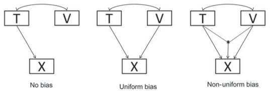

# MIMIC (and RFA) models {#ch25}

Multiple indicator multiple cause (MIMIC) models are a type of full SEM model where a common factor with multiple indicators is an endogeneous variable, cause by one or more observed variables. Technically, MIMIC models are just full SEM models with single indicator factors as exogeneous variables. What makes MIMIC models especially interesting is that they can also be used to evaluate measurement invariance across groups or across continuous variables (Muthén, 1989). Measurement invariance was defined by Mellenbergh (1998) as: 

```{=tex}
\begin{equation*}
f(X|T=t, V=v) = f(X|T=t),
\end{equation*}
```

which in plain words indicates that the distribution of $X$ given values of $T$ (representing what you want to measure) and given values of $V$ (a variable that possibly violates invariance), should be equal to the distribution of $X$ conditioned on $T$ but with varying $V$. Suppose that $X$ represents item scores, $T$ represents mathematical ability, and $V$ represents gender. In that case, measurement invariance holds if the distribution of the item scores for individuals with the same mathematical ability does not depend on gender. Mellenbergh distinguished between uniform and non-uniform bias, depending on whether the distribution of X given T is uniformly or non-uniformly affected by $V$. Figure \@ref(fig:fig25-1) shows a graphical display of the relationships between X, T and V in case of unbiased measurement, uniform measurement bias, and non-uniform measurement bias.

```{r label="fig25-1", echo = FALSE, out.width = "60%", fig.align = "center", fig.cap="Graphical representation of unbiased measurement, uniform measurement bias, and non-uniform measurement bias." }


```

In a MIMIC model, $T$ is operationalized as a common factor, $X$ is operationalized as a set of indicators reflective of that common factor, and $V$ is an observed variable. A MIMIC model that represents indicators of $T$ that are unbiased (in other words, measurement invariant) with respect to $V$ is depicted in Figure \@ref(fig:fig25-2). In this model, variable V has solely indirect effects on the indicators. So, if V represents gender, any gender effects on X are the result of gender differences in the common factor. 

```{r label="fig25-2", echo = FALSE, out.width = "50%", fig.align = "center", fig.cap="A MIMIC model." }


```


```{r setup25, include=FALSE} 
knitr::opts_chunk$set(warning = FALSE, message = FALSE) 
```
 
## Illustration testing uniform bias in a MIMIC model
The illustration uses data from the open-source psychometrics project [Open Psychometrics](https://openpsychometrics.org/_rawdata/). Specifically, we used three items from the [Humor Styles Questionnaire (HSQ)](https://doi.org/10.1016/S0092-6566(02)00534-2), designed to reflect 'affiliative humor'. These three items were scored on a 7-point scale ranging from 1 to 7.
 
 - Q5. I don’t have to work very hard at making other people laugh—I seem to be a naturally humorous person.
 - Q13. I laugh and joke a lot with my closest friends.
 - Q21. I enjoy making people laugh.

```{r}
library(lavaan)
data <- read.csv("dataHSQ.csv")

subdat <- data[,c("Q5","Q13","Q21","age","gender")]

subdat <- subdat[subdat$gender%in%c(1,2),]
subdat <- subdat[subdat$age<100,]
subdat <- subdat[rowSums(subdat[,1:3]>0)==3,]

humordat <- subdat

# descriptives of age and gender
min(humordat$age)
max(humordat$age)
median(humordat$age)

table(humordat$gender)

round(cor(humordat),3)
```

The first step when testing evaluating measurement bias with respect to some covariates with a MIMIC model would be to evaluate the factor structure without the covariates. In our example data, there are only three indicators for the construct, so the one-factor model is saturated and its fit cannot be tested. 

```{r}
library(lavaan)

# factor model without covariates
model1 <- '
	# define common factor
	humor =~ 1*Q5 + l21*Q13 + l31*Q21
	
	# indicator residual variances 
	Q5  ~~ th11*Q5
	Q13 ~~ th22*Q13
	Q21 ~~ th33*Q21

	# common factor variance (fixed)
  humor ~~ humor'

factormodelOut <- lavaan(model1, data = humordat)

summary(factormodelOut, standardized = TRUE)
```

Next, we add the variables Age and Gender to the model. The latent variable is regressed on both variables, and Age and Gender are correlated. 

```{r}
# MIMIC model with dummy Gender and continuous Age as covariate

MIMIC_genderage <- '
	# define latent common factor
	humor =~ 1*Q5 + l21*Q13 + l31*Q21

	# indicator residual variances 
	Q5 ~~ th11*Q5
	Q13 ~~ th22*Q13
	Q21 ~~ th33*Q21

	# common factor variance 
  humor ~~ humor
  gender ~~ gender
  age ~~ age

  # correlate gender age 
  gender ~~ age
  
  # regress humor on age and gender
  humor ~ b_age*age + b_gender*gender'


## fit model
MIMICgenderageOut <- lavaan(MIMIC_genderage, data = humordat)

## results
summary(MIMICgenderageOut)
```
In order to evaluate whether there are relatively large unmodeled dependencies across Gender or Age and the indicators of humor, you can evaluate correlation residuals. 

```{r}

# look at correlation residuals
resid(MIMICgenderageOut, type = "cor")

# look at modification indices
modificationIndices(MIMICgenderageOut, sort. = TRUE)
```

The largest correlation residual is found between Age and Q13. The modification indices show that adding a direct effect of Age on Q13 is expected to lead to a drop in the model's chi-square statistic of around 18.75, and that the standardized expected parameter change is -.15, which could be interpreted as substantial. Therefore, we added the direct effect of Age on Q13 to the model, representing uniform measurement bias with respect to age in the item Q13. 

```{r}
# add direct effect of age on Q13

MIMIC_genderage2 <- c(MIMIC_genderage, ' Q13 ~ age ')
# fit the new model by "updating" the original model
MIMICgenderage2Out <- update(MIMICgenderageOut, model = MIMIC_genderage2)

summary(MIMICgenderage2Out, standardized = TRUE)

# look at correlation residuals again
resid(MIMICgenderage2Out, type = "cor")

# look at modification indices
modificationIndices(MIMICgenderage2Out, sort. = TRUE)
```
Exact fit is not rejected for the modified MIMIC model ($\chi^2(3) = 5.40, p = .132$), and there are no correlation residuals larger than .10. We therefore do not modify the model further. 

The results show no significant gender or age differences in the common factor humor. The statistically significant direct effect of Age on Q13 of $\hat{\beta} = -.123$ indicated that for equal levels of 'humor', older respondents provided less positive responses to this item. To interpret this uniform bias, we would have to reflect on attributes that are specific to this item (as opposed to the other 2 items) that could cause less positive responses by older people. In this example, the item refers to laughing and joking a lot 'with my closest friends', while the other two items do not refer to specific types of social company. Since younger people may be spending more time with their closest friends (in school for example), than older people (who spend relatively more time with colleagues and family), the age bias in item Q13 may be explained by these differences in social environment. 

## Evaluating non-uniform measurement bias
The direct effects of covariates on items in a MIMIC model represent uniform measurement bias. In a multi-group model, uniform measurement bias would be reflected by unequal measurement intercepts across groups. Non-uniform bias is reflected by unequal factor loadings across groups in a multigroup model. In a MIMIC model, moderation of factor loadings by a covariate would be represented by an interaction effect of the common factor and the covariate on an indicator (Woods \& Grimm, 2011). Since we cannot directly observe the common factor scores, simply calculating each person's score on the Factor*covariate product variable is not possible. Alternative options to evaluate non-uniform measurement bias in MIMIC models are using latent moderated structures (Klein \& Moosbrugger, 2000), which however leads to inflated type 1 error rates or the product indicator approach, which has better performance (Kolbe \& Jorgensen, 2017).

## Connection with measurement invariance testing in multigroup models

In situations where the covariate is a grouping variable, meaurement invariance can also be tested in a multigroup model. For example, if variable $V$ in Figure 2 represents gender (0 = boy 1 = girl), one could evaluate measurement invariance using either a MIMIC/RFA model, or a multigroup model. A large difference between the two approaches is that in the multigroup model without equality constraints, all parameters are uniquely estimated in the two groups. So, not only the factor loadings and intercepts, but also the residual variances and the factor (co)variances are unconstrained in the configural invariance model. There is no such equivalent in the MIIMIC model, because the MIMIC model is fitted to the total sample of boys and girls together. There will be only one set of estimates for residual variances or factor variances, implying that those parameters do not differ between boys and girls.

Moreover, in A MIMIC model it is not possible to regress all indicators on $V$ simultaneously because such a model would not be identified. The MIMIC model needs so-called 'anchor items' that are assumed to be invariant and are therefore not tested. Selecting these anchor items is not an easy task (Kolbe \& Jorgensen, 2019). 

In the example analysis provides above, we started with a MIMIC model that represents no measurement bias (none of the indicators was regressed on $V$), and then used correlation residuals to identify whether any effects of V on indicators should be included. The starting point was thus the most constrained model, and we freed parameters when deemed necessary. A similar approach could be taken in a multigroup model by starting with a model that represents strong factorial invariance, and releasing equality constraints when necessary. By taking this approach one is effectively using all remaining indicators as anchor items.
  
## RFA-models

Restricted Factor Analysis (RFA) models (Oort, 1992) are statistically equivalent to MIMIC-models. The only difference is that in RFA-models the common factor is correlated with the covariates, instead of regressed on the covariates.

## References {-}
Klein, A., & Moosbrugger, H. (2000). Maximum likelihood estimation of latent interaction effects with theLMS method.*Psychometrika, 65*, 457-474.

Kolbe, L., & Jorgensen, T. D. (2017, July). *Using product indicators in restricted factor analysis models to detect nonuniform measurement bias*. In The Annual Meeting of the Psychometric Society (pp. 235-245). Springer, Cham.

Kolbe, L., & Jorgensen, T. D. (2019). Using restricted factor analysis to select anchor items and detect differential item functioning. *Behavior Research Methods, 51*(1), 138-151.

Muthén, B. O. (1989). Latent variable modeling in heterogeneous populations. *Psychometrika, 54*(4), 557-585.

Oort, F. J. (1992). Using restricted factor analysis to detect item bias. *Methodika, 6*(2), 150-166.

Woods, C. M., & Grimm, K. J. (2011). Testing for nonuniform differential item functioning with multiple indicator multiple cause models. *Applied Psychological Measurement, 35*, 339-361.
